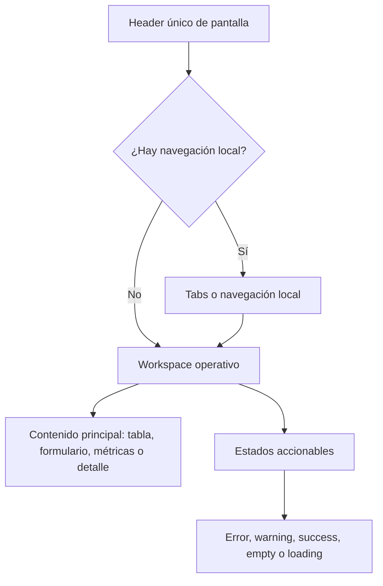

# SPEC — Portal compacta operativa · Fase 03

**Tipo:** SPEC  
**Módulo:** TRANSVERSAL — Portal empresarial tenant-aware  
**Fase:** 03 — Compactación operativa y header único  
**Versión:** 1.0  
**Estado:** Aprobado  
**Fecha:** 2026-05-04  
**Modo activo:** Senior UI Systems Designer  
**Responsable de gobierno:** AI-EM-ARCH

---

## 1. Decisión visual aprobada

La dirección visual aprobada para `apps/portal` es **Portal compacta operativa: header único + workspace**.

La regla central queda fijada así:

> Cada pantalla presenta el módulo una sola vez. Después de eso, todo debe ser navegación, estado, acción o contenido operativo.

Esta fase no busca cambiar funcionalidades, contratos API, roles, permisos, tenancy ni stack. Su objetivo es reducir sobre-rotulación, unificar jerarquía visual y hacer que todos los módulos autenticados del portal compartan una misma gramática de trabajo.

## 2. Artefactos fuente

| Tipo | Artefacto | Uso |
|---|---|---|
| Perfil | [Perfil_IA_Senior_UI_Systems_Designer_v1.md](../roles/Perfil_IA_Senior_UI_Systems_Designer_v1.md) | Autoridad visual, principios de densidad, consistencia y accesibilidad. |
| Skill | [.agents/skills/senior-ui-systems-designer/SKILL.md](../../.agents/skills/senior-ui-systems-designer/SKILL.md) | Método de auditoría y especificación visual SaaS. |
| Stack | [Stack_Tecnologico.md](../prds/Stack_Tecnologico.md) | Baseline técnico de Next.js, React, Tailwind v4 y `@iwana/ui`. |
| ADR | [ADR-023-Referencia-TailAdmin-Shell-Dashboard.md](../adrs/ADR-023-Referencia-TailAdmin-Shell-Dashboard.md) | Referencia aprobada para shell y dashboard. |
| Informe vivo | [INFORME-MOD02-DASHBOARD-EMPRESA-v1.0.md](../informes/INFORME-MOD02-DASHBOARD-EMPRESA-v1.0.md) | Evidencia histórica de Fase 02 y ajustes UI posteriores. |
| Plan previo | [PLAN-TRANSVERSAL-PORTAL-REFINAMIENTO-UI-FASE-02-v1.0.md](../plans/PLAN-TRANSVERSAL-PORTAL-REFINAMIENTO-UI-FASE-02-v1.0.md) | Baseline visual ya ejecutado: portal operativo sobrio. |

**Artefactos faltantes detectados:** no existe PRD/HLD específico de portal compacta operativa. Esta especificación actúa como artefacto visual transversal aprobado y queda subordinada a PRD, HLD y ADRs vigentes.

## 3. Problema a resolver

La auditoría del portal identificó una sobrecarga de títulos, subtítulos, eyebrows y banners informativos en módulos operativos. El patrón más costoso aparece cuando una pantalla acumula:

```text
Header del módulo
Banner informativo permanente
Card introductoria
Eyebrow
Segundo título grande
Descripción larga
Tabs
Otro header interno
Contenido real
```

Este patrón reduce densidad útil, retrasa el acceso al contenido operativo y hace que módulos como Comercial, Configuración y CRM se perciban como experiencias distintas.

## 4. Arquitectura visual objetivo



La estructura estándar para pantallas autenticadas queda:

```text
Header único de pantalla
Tabs / navegación local, si aplica
Workspace operativo
Estados accionables
```

## 5. Reglas transversales

| Elemento | Regla aprobada |
|---|---|
| `PageHeader` | Debe ser el único título principal visible de la pantalla. No debe competir con otro H1/H2 protagonista debajo. |
| Subtítulo | Máximo una línea; se elimina si repite lo obvio. |
| `PortalAlert` | Solo para error, warning, éxito temporal, permisos, bloqueo o configuración pendiente. No se usa para explicar el módulo. |
| Tabs | Deben aparecer inmediatamente después del header cuando son navegación primaria del módulo. |
| Panel activo | Titula la tarea concreta, no vuelve a presentar el módulo. |
| Eyebrow | Uso restringido a metadata o grupos secundarios; no debe actuar como mini-header repetido en cada card. |
| Cards | Se usan para unidades de contenido, formularios o datos repetibles; no para introducciones decorativas. |
| Acciones | La acción primaria vive en el header o en el panel activo, no enterrada tras texto introductorio. |
| Empty states | Pueden contener guía contextual porque aparecen solo cuando no hay datos. |

## 6. Aplicación por módulo

| Módulo | Estado objetivo |
|---|---|
| Dashboard | Mantener gramática actual; controlar que alertas onboarding no compitan con el header. |
| Usuarios | Tomar como referencia de limpieza: header, acción principal, alertas transitorias y tabla. |
| Comercial | Eliminar banner informativo permanente; tabs inmediatamente bajo header; panels sin repetir “módulo comercial” ni “oferta comercial”. |
| Configuración | Retirar introducción permanente “centro de control”; convertir overview en estado real compacto o eliminarlo si no aporta decisión. |
| CRM overview | Reemplazar hero interno por tablero operativo compacto: métricas, oportunidades recientes y acciones. |
| Expedientes y suscriptores detalle | Unificar headers custom como variante de header de detalle: título, badge, metadata, acciones y progreso compacto. |
| Perfil | Reducir competencia entre `PageHeader` y `ProfileHeader`; el segundo debe operar como bloque de identidad, no como nueva cabecera de página. |
| Auth | Mantener familia visual propia, pero con una sola intención principal, copy breve y sin repetición instructiva. |

## 7. Componentes gobernados

| Componente | Decisión |
|---|---|
| `apps/portal/src/components/layout/PageHeader.tsx` | Evolucionar hacia cabecera compacta de workspace, no tarjeta protagonista. |
| `apps/portal/src/components/shared/portal-ui.tsx` | Reforzar reglas de uso de `PortalAlert`, `PortalPanel`, `PortalSectionHeader`, empty y skeleton. |
| `CommercialTabLayout` / `SettingsTabs` | Navegación primaria inmediatamente bajo header. |
| `ExpedienteHeader` / `SubscriberHeader` | Convertir en variantes de header de detalle coherentes con `PageHeader`. |
| Formularios de Settings | Reducir header interno: menos eyebrow + h2 + descripción antes del primer campo. |

## 8. Criterios de aceptación visual

| ID | Criterio |
|---|---|
| CA-PCO-01 | Cada pantalla autenticada tiene un solo título principal visible. |
| CA-PCO-02 | No existen banners `PortalAlert` informativos permanentes que solo expliquen el módulo. |
| CA-PCO-03 | Las tabs primarias aparecen antes de cualquier bloque descriptivo del módulo. |
| CA-PCO-04 | Los paneles internos nombran tareas concretas, no repiten el nombre del módulo. |
| CA-PCO-05 | En mobile no se apilan tres o más bloques de texto antes del contenido útil. |
| CA-PCO-06 | Los formularios largos no presentan más de dos niveles de encabezado antes del primer campo. |
| CA-PCO-07 | Dashboard, Comercial, Configuración, CRM, Usuarios y Perfil comparten la misma gramática de header, workspace, estados y acciones. |
| CA-PCO-08 | Los estados empty/error/loading/warning/success mantienen foco visible, contraste AA y copy en español sentence case. |
| CA-PCO-09 | No se introducen nuevas librerías UI, tokens globales ni `tailwind.config.js`. |
| CA-PCO-10 | La validación técnica y visual queda registrada en el informe vivo del portal. |

## 9. Fuera de alcance

- Cambios backend, migraciones, endpoints, DTOs o contratos OpenAPI.
- Cambios de roles, permisos, tenancy, auth, MFA o `api-client` salvo ajustes estrictamente visuales sin semántica funcional.
- Cambio de paleta global, tipografía global, librería UI o Tailwind config.
- Rediseño funcional de flujos CRM, Comercial, Settings o Usuarios.
- Extracción obligatoria a `packages/ui`; esta fase puede operar con primitives locales si el alcance sigue siendo portal.

## 10. Criterios de salida

- Spec, plan y prompt versionados.
- Ejecución Fullstack alineada al patrón header único + workspace.
- Validaciones mínimas al cierre:

```bash
pnpm --filter @iwana/portal test
pnpm --filter @iwana/portal typecheck
pnpm --filter @iwana/portal lint
pnpm test:e2e:portal
```

- Evidencia visual desktop y mobile de rutas principales.
- Informe vivo actualizado con comandos, resultados, archivos tocados y deuda residual.
