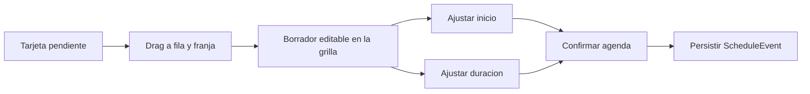

# SPEC: Agenda diaria WFM con borrador editable y despacho directo

**Version:** 1.1  
**Estado:** Listo para ejecucion  
**Fecha:** 2026-06-19  
**Modo activo:** Mixto  
**Modulo:** WFM Scheduling (Portal)  
**Ruta:** /dashboard/scheduling/agenda  
**Owner de ejecucion:** Sr. Dev Fullstack  
**Reporta a:** EM + Architect Unificado  
**Perfil rector:** docs/roles/Perfil_IA_EM_Architect_Unificado_v1.md  
**Specs relacionadas:** SPEC-WFM-PENDING-VISITS-CALENDAR-FIRST-v1.0.md, SPEC-WFM-COMMAND-CENTER-REDISTRIBUCION-v1.0.md  
**HLD rector:** docs/hlds/HLD-MOD09-PROGRAMACION-WFM-v1.0.md  
**PRD rector:** docs/prds/PRD-MOD09-PROGRAMACION-WFM-v1.0.md

---

## 1. Objetivo

Rediseñar la vista `Despacho diario` de `WFM Scheduling` para que funcione como mesa operativa real de asignacion y ajuste de agenda, no solo como una grilla consultiva con bandeja lateral.

La decision aprobada para esta iteracion es:

1. La tarjeta pendiente se convierte en insumo de agenda y debe poder arrastrarse a una franja.
2. Al soltar una tarjeta no se confirma una agenda final: se crea un **borrador editable**.
3. El borrador debe permitir mover, acortar y alargar la franja antes de confirmar.
4. La columna `Responsable` debe compactarse para devolver espacio a la grilla horaria.
5. La rail `Pendientes por programar` debe simplificar copy y eliminar redundancias visuales.
6. La vista diaria debe dejar documentado y corregido el desacople actual entre la grilla fija `06:00-20:00` y la ventana operativa real usada por el dominio.

## 2. Problema actual

La vista actual presenta cuatro fricciones estructurales:

1. La columna `Responsable` consume demasiado ancho para el valor que aporta en la tarea principal de despacho.
2. La rail lateral repite proposito en eyebrow, titulo y descripcion, y la tarjeta pendiente duplica estado, tipo y referencias sin jerarquia operativa clara.
3. La solicitud pendiente solo permite CTA de click (`Programar`) y no flujo directo sobre la grilla.
4. La grilla diaria usa una ventana fija `06:00-20:00`, mientras la ventana operativa dinamica solo se aplica en formularios, recomendaciones y reagendamiento para instalaciones.

Resultado observado:

1. Menor densidad util del calendario.
2. Mayor friccion para convertir una solicitud lista en una agenda operativa.
3. Percepcion de agenda “semi manual” y fragmentada.
4. Riesgo de decisiones inconsistentes entre lo que la UI muestra como disponible y lo que backend realmente permite para instalaciones.

## 3. Hallazgos confirmados

### 3.1 Grilla horaria fija

La franja visible actual sale de constantes hardcodeadas en frontend:

1. `TIMELINE_START_HOUR = 6`
2. `TIMELINE_END_HOUR = 20`

Eso genera:

1. labels visibles de `06:00` a `19:00`
2. slots de media hora de `06:00` a `19:30`

Archivo afectado principal:

1. `apps/portal/src/components/scheduling/ScheduleCalendar.tsx`

### 3.2 Ventana operativa real desacoplada

La ventana operativa dinamica ya existe y se consume mediante:

1. `apps/portal/src/components/scheduling/useOperatingWindow.ts`
2. `apps/api/src/modules/wfm/services/operating-window-resolver.service.ts`

Pero hoy:

1. la grilla diaria no la usa como fuente de viewport ni de interaccion
2. el backend resuelve `HOLIDAY_BLACKOUT`, `COMPANY_HOURS` y configuracion faltante
3. el contrato frontend ya contempla `SITE_HOURS`, pero el resolver actual no lo emite como horario normal de sede

### 3.3 Columna izquierda sobredimensionada

La tabla diaria reserva demasiado espacio para `Responsable` y reduce el area de trabajo real de agenda. El layout actual combina:

1. columna izquierda fija
2. rail derecha fija
3. tabla con ancho minimo alto

Eso castiga la grilla central, que es donde ocurre la accion primaria.

### 3.4 Tarjeta pendiente sin lenguaje de despacho directo

La rail lateral no esta optimizada para priorizar y convertir solicitudes en agenda:

1. el texto descriptivo del encabezado sobra
2. `Lista para agendar` y `Instalacion` compiten como señales
3. cliente y referencia pueden sentirse repetidos
4. el CTA `Programar` obliga a un paso intermedio, en vez de permitir arrastre y ajuste contextual

## 4. Decision de producto y arquitectura UX

Se aprueba una evolucion de `Despacho diario` hacia una experiencia **calendar-first con rail asistida**, donde la grilla sigue siendo la superficie dominante y la bandeja lateral pasa a ser fuente de trabajo inmediato.

### 4.1 Regla principal

1. La rail lateral no confirma agendas.
2. La grilla diaria es la superficie primaria para colocar la solicitud.
3. El primer resultado de un drop es un **borrador editable**.
4. La confirmacion final sigue siendo explicita y gobernada por el flujo actual del dominio.

### 4.2 Flujo operativo aprobado



### 4.3 Principios UX rectores

1. Claridad antes que decoracion.
2. La agenda debe sentirse como herramienta de despacho, no como tabla narrativa.
3. El usuario necesita capacidad de ajuste fino antes de confirmar.
4. El color no sera el unico portador de estado.
5. El backend sigue siendo arbitro final de disponibilidad y ventana valida.

## 5. Alcance

### 5.1 Incluye

1. Compactacion visual y funcional de la columna `Responsable`.
2. Limpieza de copy en la rail `Pendientes por programar`.
3. Rediseño de la tarjeta pendiente para escaneo rapido y drag source.
4. Creacion de borrador editable sobre la grilla diaria.
5. Interaccion de mover y redimensionar borrador antes de confirmar.
6. Alineacion minima entre viewport diario y ventana operativa real.
7. Ajustes de pruebas frontend y backend relacionados con agenda diaria.

### 5.2 No incluye

1. Reemplazo completo de la vista semanal o mensual.
2. Refactor total del modulo Scheduling fuera de la vista diaria.
3. Nueva libreria obligatoria de drag-and-drop si el flujo puede resolverse con eventos nativos.
4. Cambio de boundary entre CRM, WFM y Assurance.
5. Nueva estrategia de recomendaciones algoritmicas.

## 6. Resultado esperado

Al cerrar la iteracion, `Despacho diario` debe cumplir esto:

1. La columna `Responsable` ocupa menos ancho y la grilla gana aire operativo.
2. La rail lateral comunica menos y ayuda mas.
3. Una solicitud pendiente puede arrastrarse a una fila/horario.
4. El drop crea un borrador visible y editable en la grilla.
5. El borrador puede desplazarse horizontalmente y redimensionarse desde ambos extremos.
6. La agenda final no se confirma automaticamente al soltar.
7. La vista deja de mentir sobre disponibilidad para instalaciones: al menos debe reflejar o sombrear la ventana operativa vigente cuando exista contexto suficiente.

## 7. Decisiones de interfaz aprobadas

### 7.1 Columna `Responsable`

Reglas aprobadas:

1. Reducir la huella horizontal respecto al `min-w-[260px]` actual.
2. Mantener avatar o iniciales, nombre y una sola linea secundaria compacta.
3. Eliminar narrativa larga dentro de la fila principal.
4. `Cruce visible` debe degradarse a una señal compacta y no a un tercer bloque protagonista.

Comportamiento esperado:

1. La fila sigue siendo reconocible por tecnico.
2. El foco visual vuelve a la agenda, no a la metadata lateral.

### 7.2 Encabezado de rail

Reglas aprobadas:

1. Conservar `Pendientes por programar` como titulo dominante.
2. Eliminar el texto descriptivo “Tareas listas para pasar a agenda...” en la cabecera.
3. El eyebrow `Cola operativa` puede mantenerse solo si no compite con el titulo; si sigue sintiendose redundante, se elimina.

### 7.3 Tarjeta pendiente

Nueva anatomia aprobada:

1. Linea principal: cliente o referencia dominante.
2. Linea secundaria: territorio compacto y urgencia temporal.
3. Chips secundarios: tipo de trabajo y estado solo si agregan valor.
4. Quitar `Lista para agendar` cuando el contexto de rail ya lo hace obvio.
5. Evitar repetir cliente y referencia si comunican lo mismo.
6. Sustituir `Programar` como accion principal por affordance de arrastre y una accion secundaria discreta `Abrir`.

### 7.4 Borrador editable

El bloque de borrador debe:

1. verse distinto al evento confirmado
2. mostrar etiqueta `Borrador`
3. ocupar la fila del responsable y la franja elegida
4. permitir mover el inicio
5. permitir ajustar duracion desde ambos extremos
6. mostrar feedback local si queda invalido

## 8. Reglas de interaccion

### 8.1 Drag source

La tarjeta pendiente debe poder iniciarse como arrastre desde la rail lateral.

Contenido minimo del payload de arrastre:

1. `visitRequestId`
2. `organizationSiteId`
3. `workType`
4. `durationMinutes` inicial
5. `customerDisplayName`
6. `title`

### 8.2 Drop target

Las celdas de media hora de la agenda diaria deben convertirse en targets de drop.

Al soltar:

1. se resuelve `assignedUserId`
2. se resuelve `dayKey`
3. se resuelve `scheduledStartAt`
4. se calcula `scheduledEndAt` con duracion inicial
5. se crea un draft local

### 8.3 Ajustes del borrador

Acciones requeridas:

1. arrastrar el bloque para mover inicio
2. drag desde borde izquierdo para adelantar/atrasar inicio
3. drag desde borde derecho para ampliar/reducir fin
4. snap minimo de 15 minutos
5. snap visual preferente a media hora si coincide con la malla principal

### 8.4 Confirmacion

La confirmacion sigue siendo explicita.

Se aprueban dos salidas validas:

1. confirmar desde un CTA contextual del borrador
2. abrir el flujo de confirmacion existente con el draft ya precargado

No se aprueba:

1. crear evento persistido automaticamente al soltar
2. confirmar un borrador cuya franja de inicio ya paso respecto al momento actual

### 8.5 Regla anti-pasado

Regla transversal de agenda WFM, aplicable al despacho diario y al resto de superficies de programacion del portal.

1. No se puede agendar, reagendar ni confirmar una tarea con `scheduledStartAt` anterior al instante actual.
2. Backend es arbitro final mediante `assertScheduleStartNotInPast()` en creacion, actualizacion de horario, reagendamiento y `scheduleVisitRequest`.
3. En la grilla diaria, las franjas pasadas del dia visible quedan deshabilitadas para clic y drop.
4. El borrador editable expone el estado `in-the-past` y no permite confirmacion mientras persista.
5. Mensaje visible al usuario: *No se pueden agendar tareas en una fecha u hora anterior al momento actual*.

## 9. Regla arquitectonica sobre ventana operativa

Esta spec no autoriza mantener la ambiguedad actual entre grilla y validacion.

### 9.1 Decision aprobada

La implementacion debe introducir una capa de **display window** para la vista diaria.

### 9.2 Regla funcional minima

1. Si existe contexto suficiente de instalacion con `organizationSiteId`, la grilla debe reflejar la ventana operativa efectiva del dia.
2. Si no existe contexto puntual, la vista puede usar horario base de empresa como referencia visual.
3. Si no existe configuracion operativa resoluble, la UI puede caer a `06:00-20:00` solo como fallback tecnico documentado.

### 9.3 Regla de enforcement

1. Para instalaciones, el borrador no puede confirmarse fuera de ventana operativa.
2. Si el usuario suelta o redimensiona fuera de rango, la UI debe rechazar o autocorregir el draft antes de confirmar.
3. La correccion debe ser visible y local, no solo un error tardio en modal.

### 9.4 Ajuste backend requerido

El resolver de ventana operativa debe alinearse con el contrato que frontend ya tipa:

1. agregar resolucion normal de horario por sede cuando aplique
2. emitir `SITE_HOURS` si la fuente efectiva es horario de sede
3. mantener `COMPANY_HOURS` como fallback
4. mantener `HOLIDAY_BLACKOUT` con maxima prioridad

## 10. Estrategia tecnica sugerida

### 10.1 En frontend

Crear o consolidar un estado de draft local en `SchedulingClient` o en un hook de scheduling diario:

```ts
type DailyDraftEvent = {
  visitRequestId: string;
  assignedUserId: string;
  dayKey: string;
  scheduledStartAt: string;
  scheduledEndAt: string;
  durationMinutes: number;
  source: 'pending-visit-drop';
  validationState: 'valid' | 'out-of-window' | 'conflict' | 'incomplete' | 'in-the-past';
};
```

### 10.2 Responsabilidades sugeridas

1. `SchedulingClient` orquesta rail, draft y confirmacion.
2. `ScheduleCalendar` renderiza targets, borrador y gestos.
3. `useOperatingWindow` y helpers de tiempo alimentan validaciones del draft.
4. `ScheduleVisitRequestConfirmDialog` o `SchedulingQuickCreateDialog` reciben el draft final ya ajustado.

### 10.3 Dependencias

Regla preferida:

1. resolver con eventos nativos o pointer events antes de introducir una libreria DnD nueva

Solo si el flujo queda inestable o demasiado costoso con primitives nativas, se permite una recomendacion posterior de libreria. Esa recomendacion no forma parte de la decision aprobada inicial.

## 11. Mapeo tecnico por archivo

### 11.1 Frontend portal

1. `apps/portal/src/components/scheduling/ScheduleCalendar.tsx`
   - compactar columna izquierda
   - limpiar rail header
   - redibujar tarjeta pendiente
   - agregar drag source / drop target
   - renderizar borrador editable
   - introducir display window y sombreado fuera de ventana
2. `apps/portal/src/components/scheduling/SchedulingClient.tsx`
   - orquestar estado del draft
   - conectar solicitud pendiente con confirmacion
   - resolver reglas de apertura de dialogo o CTA de confirmacion
3. `apps/portal/src/components/scheduling/schedule-event-time.ts`
   - helpers de snap, resize y validacion de draft
   - reutilizar validacion de ventana operativa donde aplique
   - helpers `isScheduleStartInPast()` e `isScheduleDaySlotInPast()`
4. `apps/portal/src/components/scheduling/useOperatingWindow.ts`
   - soportar el caso de display window diario
   - mantener mensajes claros por fuente de ventana
5. `apps/portal/src/lib/api-client.ts`
   - alinear contrato `WfmOperatingWindowResult` con `SITE_HOURS` real si backend lo emite

### 11.2 Backend API

1. `apps/api/src/modules/wfm/services/operating-window-resolver.service.ts`
   - resolver sede antes de empresa cuando exista configuracion
   - emitir `SITE_HOURS`
2. `apps/api/src/modules/wfm/wfm.controller.ts`
   - sin cambio de ruta esperado
3. tests de WFM relacionados con operating window
   - ajustar cobertura de fuente y prioridad
4. `apps/api/src/modules/wfm/services/schedule-past-guard.ts`
   - guard compartido de inicio en el pasado para eventos y visit requests

## 12. Criterios de aceptacion

### 12.1 Funcionales

1. Una solicitud pendiente puede arrastrarse desde la rail a una franja diaria.
2. El drop crea un borrador editable y no un evento persistido.
3. El borrador puede moverse y redimensionarse antes de confirmar.
4. El usuario puede confirmar el borrador usando el flujo de agenda existente.
5. La solicitud correcta queda asociada al evento confirmado.
6. No se puede confirmar ni persistir una agenda con inicio en el pasado.

### 12.2 Visuales

1. La columna `Responsable` ocupa menos espacio y mejora la densidad de agenda.
2. La rail lateral pierde texto redundante.
3. La tarjeta pendiente se escanea mas rapido y ya no duplica informacion innecesaria.
4. El borrador se diferencia claramente del evento confirmado.

### 12.3 Ventana operativa

1. La vista diaria deja de depender solo de la franja fija `06:00-20:00` como unica verdad.
2. Para instalaciones con contexto suficiente, la UI refleja la ventana efectiva del dia.
3. Un borrador fuera de ventana no puede confirmarse silenciosamente.
4. Un borrador en el pasado no puede confirmarse.
5. Backend puede devolver `SITE_HOURS` cuando la fuente efectiva sea la sede.

### 12.4 Accesibilidad

1. El borrador y sus controles tienen foco visible.
2. Los handles de ajuste son alcanzables por mouse y keyboard cuando sea viable.
3. Estado invalido, seleccion y confirmacion no dependen solo del color.

### 12.5 Calidad

1. Tests unitarios de `ScheduleCalendar` y `SchedulingClient` actualizados y en verde.
2. Tests de operating window backend actualizados y en verde.
3. E2E de scheduling portal cubren drag, ajuste y confirmacion.

## 13. Plan minimo de pruebas

### Frontend unitarias

1. crea un draft local al hacer drop sobre una celda valida
2. mueve el draft a otra franja sin perder `visitRequestId`
3. redimensiona el draft respetando minimo de 15 minutos
4. rechaza o marca invalido un draft fuera de ventana operativa
5. rechaza o marca invalido un draft en el pasado (`in-the-past`)
6. mantiene compacto el header lateral y la nueva tarjeta sin duplicaciones criticas

### Backend

1. prioriza `HOLIDAY_BLACKOUT` sobre horario de sede y empresa
2. devuelve `SITE_HOURS` cuando existe configuracion de sede para la fecha
3. cae a `COMPANY_HOURS` cuando no existe regla de sede
4. devuelve `MISSING_CONFIGURATION` cuando no existen reglas aplicables
5. rechaza crear, reagendar o agendar visita con inicio en el pasado (`schedule-past-guard.ts`)

### E2E

1. arrastrar solicitud pendiente a tecnico y hora validos
2. ajustar el borrador antes de confirmar
3. confirmar agenda y verificar persistencia correcta
4. intentar colocar borrador fuera de ventana y recibir feedback util

## 14. Riesgos y mitigacion

1. Riesgo: alta complejidad interactiva dentro de `ScheduleCalendar.tsx`.
   - Mitigacion: extraer helpers y estado de draft a unidades enfocadas si el archivo crece demasiado.
2. Riesgo: introducir gestos fragiles con mouse solamente.
   - Mitigacion: definir degradacion usable por click y teclado para confirmacion y ajuste basico.
3. Riesgo: inconsistencias entre validacion UI y backend.
   - Mitigacion: reutilizar helpers de ventana y reforzar tests de contrato.
4. Riesgo: nueva rail siga cargando demasiado copy.
   - Mitigacion: revisar con criterio de densidad operativa, no de marketing.

## 15. Secuencia de ejecucion Fullstack

1. Corregir resolver de ventana operativa y pruebas backend.
2. Introducir modelo de draft editable en frontend.
3. Compactar columna `Responsable` y limpiar rail lateral.
4. Rediseñar tarjeta pendiente como drag source.
5. Implementar drop target y render del borrador.
6. Implementar move + resize + validacion local.
7. Conectar confirmacion final con el flujo existente.
8. Ejecutar pruebas unitarias, backend y E2E.
9. Actualizar informe vivo del modulo con evidencia de ejecucion.

## 16. Definition of done

1. `Despacho diario` funciona como mesa de agenda editable y no solo como lista con CTA lateral.
2. La rail permite arrastre directo desde solicitud pendiente.
3. El borrador editable existe, se ajusta y se confirma correctamente.
4. La columna `Responsable` deja de penalizar la grilla.
5. La ventana operativa queda alineada entre UI y backend para el caso de instalaciones.
6. No se introducen nuevas dependencias sin justificacion formal.
7. Las pruebas relevantes quedan actualizadas y verdes.

## 17. Referencias

1. `apps/portal/src/components/scheduling/ScheduleCalendar.tsx`
2. `apps/portal/src/components/scheduling/SchedulingClient.tsx`
3. `apps/portal/src/components/scheduling/useOperatingWindow.ts`
4. `apps/portal/src/components/scheduling/schedule-event-time.ts`
5. `apps/api/src/modules/wfm/services/operating-window-resolver.service.ts`
6. `apps/api/src/modules/wfm/services/schedule-past-guard.ts`
7. `docs/roles/Perfil_IA_EM_Architect_Unificado_v1.md`
8. `docs/roles/Perfil_IA_Senior_UI_Systems_Designer_v1.md`
9. `docs/specs/SPEC-WFM-PENDING-VISITS-CALENDAR-FIRST-v1.0.md`
10. `docs/specs/SPEC-WFM-COMMAND-CENTER-REDISTRIBUCION-v1.0.md`
