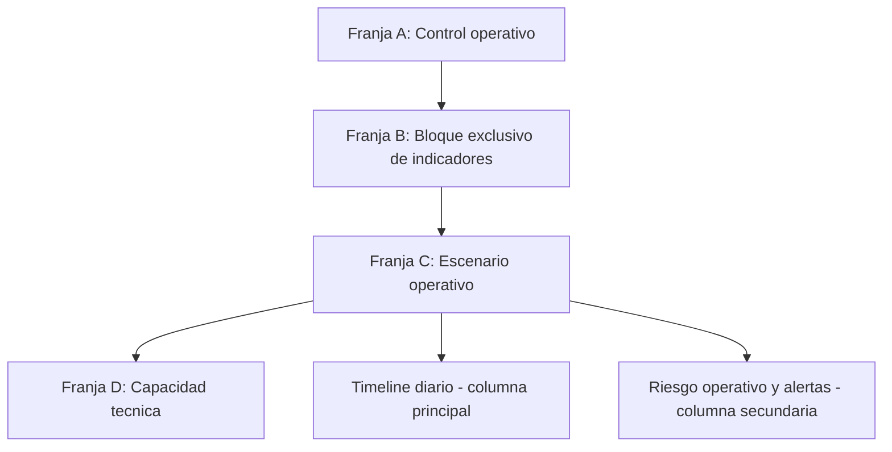

# SPEC: Redistribucion Centro operativo WFM

**Version:** 1.0  
**Estado:** Ejecutado  
**Fecha:** 2026-06-04  
**Modulo:** WFM Scheduling (Portal)  
**Owner de ejecucion:** Sr. Dev Fullstack

## 1. Objetivo

Rediseñar la primera pantalla de Centro operativo para mejorar distribucion de espacio, lectura operativa y velocidad de accion, manteniendo identidad corporativa iWana.

Decisiones ya aprobadas para esta ejecucion:

1. Direccion 3 Ambiciosa.
2. Opcion B para datos de bandeja pendiente: extender contrato de `GET /api/v1/wfm/dashboard/summary`.
3. Tarjeta de bandeja pendiente del mismo tamaño que los demas indicadores.

## 2. Resultado esperado

1. Centro operativo con cuatro franjas visuales claras: control, indicadores, operacion principal y capacidad tecnica.
2. Indicadores con espacio propio y sin competir con timeline/alertas.
3. Nueva tarjeta de bandeja pendiente al mismo tamano visual de las otras 5 tarjetas de indicadores.
4. Contrato backend unico que entregue datos de bandeja dentro del summary.

## 3. Alcance

### Incluye

1. Ajuste de layout y jerarquia de `Centro operativo` en portal.
2. Extension aditiva de `WfmDashboardSummary` en API y cliente portal.
3. Nueva tarjeta de indicador `Bandeja pendiente` con CTA a bandeja.
4. Ajustes de pruebas en API, frontend unitario y E2E de scheduling.

### No incluye

1. Rediseno de vista `Calendario` o `Lista` fuera de impactos colaterales.
2. Cambios de stack, boundaries o nuevas dependencias.
3. Migraciones de base de datos.

## 4. Arquitectura visual aprobada

### Franja A: Control operativo

1. Header principal de Programacion.
2. Toolbar desacoplado por grupos:
   - Grupo filtros de rango/tecnico/tipo/estado.
   - Grupo de vista (`Centro operativo`, `Calendario`, `Lista`).
   - Grupo de acciones (`Actualizar`, `Crear evento`).

### Franja B: Bloque exclusivo de indicadores

1. Grid de 6 tarjetas de indicadores, todas del mismo tamano:
   - Activos
   - Atrasados
   - Proximos 7 dias
   - En ruta
   - En riesgo
   - Bandeja pendiente
2. Sin tarjetas anidadas dentro de este bloque.
3. Misma altura minima para todas las tarjetas.

### Franja C: Escenario operativo

1. Columna principal: Timeline diario.
2. Columna secundaria: Riesgo operativo (alertas y acciones).
3. Mantener apertura de detalle por click en evento/alerta.

### Franja D: Capacidad tecnica

1. Banda independiente al final, sin comprimir el bloque de indicadores.
2. Mantener resumen de carga + OT abiertas + disponibilidad.

## 5. Breakpoints y distribucion

### Desktop amplio (>=1536)

1. Franja B: 6 columnas de indicadores (1 fila).
2. Franja C: 8/4 (principal/secundaria).

### Desktop medio y laptop (>=1280 y <1536)

1. Franja B: 3x2 (6 indicadores en 2 filas).
2. Franja C: 7/5 o 2fr/1.2fr segun densidad final.

### Tablet (>=768 y <1280)

1. Franja B: 2 columnas (3 filas).
2. Franja C: apilado vertical (timeline arriba, alertas abajo).

### Mobile (<768)

1. Franja B: 2 columnas estables.
2. Franja C y D: stack vertical con orden de prioridad operativa.
3. CTA de bandeja pendiente siempre visible dentro de su tarjeta de indicador.

## 6. Extension de contrato backend (Opcion B)

### Endpoint objetivo

1. `GET /api/v1/wfm/dashboard/summary`

### Contrato actual

1. `todayCount`, `overdueCount`, `upcomingCount`, `activeCount`, `enRouteCount`, `atRiskCount`, `alerts`, `technicianLoad`.

### Contrato nuevo (aditivo)

Agregar nodo `pendingInbox`:

1. `totalOpen`: cantidad total abierta en bandeja (`PENDING`, `NEEDS_CONTEXT`, `READY_TO_SCHEDULE`).
2. `readyToScheduleCount`: cantidad en `READY_TO_SCHEDULE`.
3. `needsContextCount`: cantidad en `NEEDS_CONTEXT`.
4. `overdueSlaCount`: abiertas con `slaDueAt` vencido (tiempo comprometido).
5. `highPriorityOpenCount`: abiertas con prioridad `HIGH` o `URGENT`.

### Regla de compatibilidad

1. Cambio aditivo, no rompe consumidores actuales.
2. Si falla calculo de `pendingInbox`, no romper summary completo: responder valores en `0` y registrar warning tecnico.

## 7. Mapeo tecnico por archivo

### API (apps/api)

1. `apps/api/src/modules/wfm/services/wfm-dashboard.service.ts`
   - Extender interfaz `WfmDashboardSummary`.
   - Implementar query de agregacion para `pendingInbox`.
2. `apps/api/src/modules/wfm/tests/wfm.controller.http.spec.ts`
   - Ajustar fixtures y asserts del summary extendido.
3. `apps/api/src/modules/wfm/wfm.controller.ts`
   - Mantener endpoint; sin cambios de ruta.

### Frontend portal (apps/portal)

1. `apps/portal/src/lib/api-client.ts`
   - Extender tipo `WfmDashboardSummary` con `pendingInbox`.
2. `apps/portal/src/components/scheduling/SchedulingOverview.tsx`
   - Reestructurar franjas B y C.
   - Incorporar indicador `Bandeja pendiente` (mismo tamano).
   - CTA a `/dashboard/scheduling/pending-visits`.
3. `apps/portal/src/components/scheduling/SchedulingClient.tsx`
   - Ajustar composicion de bloques y orden de render.
4. `apps/portal/src/components/scheduling/SchedulingToolbar.tsx`
   - Redistribuir grupos de control por breakpoints.

### Pruebas frontend

1. `apps/portal/src/components/scheduling/SchedulingOverview.spec.tsx` (crear o actualizar)
   - Validar render de 6 indicadores y CTA de bandeja.
2. `e2e/tests/portal-wfm-scheduling.spec.ts`
   - Agregar/ajustar escenario de visibilidad y navegacion desde tarjeta de indicador de bandeja.

## 8. Definicion visual de la nueva tarjeta de indicador "Bandeja pendiente"

1. Misma anatomia visual que las otras tarjetas de indicadores (radio, borde, padding, altura).
2. Titulo: `Bandeja pendiente`.
3. Valor principal: `totalOpen`.
4. Sublinea de soporte:
   - `Listas para agendar: {readyToScheduleCount}`
   - `Sin contexto completo: {needsContextCount}`
5. Estado de riesgo visible por texto secundario:
   - `Con tiempo comprometido vencido: {overdueSlaCount}`.
6. CTA secundario inline: `Ir a bandeja pendiente`.
7. Mantener contraste y foco visible AA.

## 9. Criterios de aceptacion

### Funcionales

1. El summary devuelve `pendingInbox` con los 5 campos definidos.
2. Centro operativo renderiza 6 indicadores sin romper layouts existentes.
3. Tarjeta `Bandeja pendiente` navega a `/dashboard/scheduling/pending-visits`.

### Visuales y UX

1. Los indicadores tienen espacio exclusivo y ya no compiten con timeline/alertas.
2. Las 6 tarjetas de indicadores conservan mismo tamano dentro de cada breakpoint.
3. La primera pantalla se percibe menos ajustada y con prioridad operativa clara.

### Accesibilidad

1. Focus visible en tarjeta/CTA de bandeja.
2. Texto y estados con contraste WCAG AA.
3. Jerarquia tipografica legible en desktop y mobile.

### Calidad

1. Tests HTTP de API actualizados y pasando.
2. Tests unitarios frontend de overview pasando.
3. E2E scheduling pasando en config portal.

## 10. Plan de pruebas

### API

1. `pnpm --filter @iwana/api test -- wfm.controller.http.spec.ts`

### Portal unit

1. `pnpm --filter @iwana/portal test -- SchedulingOverview.spec.tsx`

### E2E

1. `pnpm exec playwright test --config e2e/playwright.portal.config.ts e2e/tests/portal-wfm-scheduling.spec.ts`

## 11. Riesgos y mitigacion

1. Riesgo: sobrecarga de consulta summary por agregacion extra.
   - Mitigacion: query agregada simple con filtros indexables por estado/prioridad/tiempo comprometido.
2. Riesgo: regresion visual en otros modos de vista.
   - Mitigacion: mantener cambios encapsulados en vista `Centro operativo`.
3. Riesgo: desalineacion de contrato API/portal.
   - Mitigacion: actualizar tipos y tests en el mismo PR.

## 12. Secuencia de ejecucion Fullstack

1. Extender backend summary + tests API.
2. Actualizar tipo frontend `WfmDashboardSummary`.
3. Reestructurar `SchedulingOverview` con bloque de 6 indicadores.
4. Reordenar layout en `SchedulingClient` y toolbar.
5. Ajustar/crear tests unitarios.
6. Ejecutar E2E de scheduling.
7. Cierre con evidencia en informe vivo.

## 13. Referencias

1. `apps/api/src/modules/wfm/services/wfm-dashboard.service.ts`
2. `apps/api/src/modules/wfm/wfm.controller.ts`
3. `apps/api/src/modules/wfm/tests/wfm.controller.http.spec.ts`
4. `apps/portal/src/components/scheduling/SchedulingClient.tsx`
5. `apps/portal/src/components/scheduling/SchedulingOverview.tsx`
6. `apps/portal/src/components/scheduling/SchedulingToolbar.tsx`
7. `apps/portal/src/lib/api-client.ts`
8. `docs/roles/_historico/Perfil_IA_Senior_UI_Systems_Designer_v1.md`

## 14. Estado de ejecucion (2026-06-04)

### Fase 1 - Backend contrato

1. Se extendio `WfmDashboardSummary` con nodo `pendingInbox`.
2. Se implemento agregacion de bandeja en `wfm-dashboard.service` con fallback seguro a `0`.
3. Se ajustaron pruebas de servicio y contrato HTTP.

### Fase 2 - Frontend layout

1. Se extendio el tipo frontend `WfmDashboardSummary` con `pendingInbox`.
2. `SchedulingOverview` ahora tiene bloque exclusivo de indicadores con 6 tarjetas del mismo tamano.
3. Se agrego tarjeta `Bandeja pendiente` con lenguaje orientado a operacion:
   - `Listas para programar`
   - `Faltan datos por completar`
   - `Con tiempo comprometido vencido`
4. Se redistribuyo `SchedulingToolbar` por grupos responsive.
5. `SchedulingClient` en vista `Centro operativo` ahora evita compresion lateral y muestra capacidad tecnica en bloque independiente.

### Fase 3 - Pruebas y validacion

1. API unit/integration objetivo:
   - `wfm-dashboard.service.spec.ts`: 5 passed, 0 failed.
   - `wfm.controller.http.spec.ts`: 28 passed, 0 failed.
2. Portal unit objetivo:
   - `SchedulingOverview.spec.tsx` + `SchedulingClient.spec.tsx`: 9 passed, 0 failed.
3. E2E scheduling portal:
   - `e2e/tests/portal-wfm-scheduling.spec.ts`: 9 passed, 0 failed.
