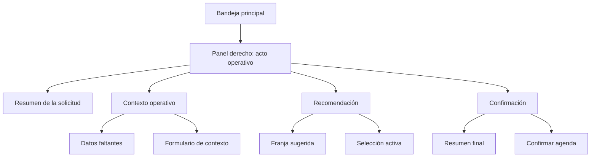

# SPEC: Rediseño del acto operativo de Visitas pendientes

**Version:** 1.0  
**Estado:** Ejecutado  
**Fecha:** 2026-06-04  
**Modulo:** WFM Scheduling (Portal)  
**Owner de ejecucion:** Sr. Dev Fullstack

## 1. Objetivo

Rediseñar la ruta `/dashboard/scheduling/pending-visits` para que el operador gestione solicitudes de instalación de fibra óptica dentro de un acto operativo claro, rápido y no fragmentado.

La pantalla debe facilitar tres tareas sin cambiar de contexto:

1. Revisar la solicitud y su contexto operativo.
2. Completar los datos necesarios para recomendar una franja.
3. Confirmar la agenda y, si aplica, crear la orden de trabajo asociada.

## 2. Problema actual

La vista actual funciona como un master-detail correcto a nivel funcional, pero la experiencia todavía mezcla demasiada información y demasiadas acciones dentro del mismo plano visual.

Hallazgos principales:

1. El panel derecho concentra lectura, edición, recomendación y confirmación en una sola columna con crecimiento vertical excesivo.
2. El operador debe recorrer demasiado contenido para entender qué falta, qué se puede hacer ahora y cuál es la acción final.
3. La jerarquía visual no separa con suficiente claridad datos del ticket, formulario de contexto, recomendación y confirmación.
4. Los estados críticos y los badges informativos comparten un mismo peso visual, lo que reduce la prioridad operativa.
5. El panel derecho depende del scroll general de la página y no se percibe como una unidad de trabajo propia.

## 3. Resultado esperado

1. La ruta se percibe como un solo acto operativo guiado, no como varias tarjetas independientes.
2. La bandeja izquierda mantiene la búsqueda y selección de solicitudes.
3. El panel derecho se comporta como una superficie operativa con scroll propio y jerarquía interna clara.
4. El operador entiende en segundos qué solicitud tiene delante, qué falta completar y cuál es la siguiente acción.
5. La experiencia prioriza lectura rápida, decisión y ejecución, sin usar modales para todo el flujo.

## 4. Alcance

### Incluye

1. Rediseño del panel derecho del acto operativo de Visitas pendientes.
2. Reorganización de la jerarquía visual entre resumen, contexto, recomendación y confirmación.
3. Ajuste del comportamiento vertical del panel derecho para que use su propio `overflow-y-auto` en desktop.
4. Uso de bloques colapsables para reducir densidad cuando el contexto ya fue completado.
5. Revisión de tarjetas, badges y microcopy visible para mejorar claridad y escaneabilidad.
6. Ajuste de pruebas unitarias y E2E vinculadas a la ruta.

### No incluye

1. Cambios de backend en contratos de negocio.
2. Migraciones de base de datos.
3. Replanteamiento de la bandeja principal izquierda como producto distinto.
4. Introducción de una pestaña nueva para desplazar el flujo principal.
5. Conversión del despacho completo a modal.

## 5. Decisión de UX

### Decisión principal

El acto operativo debe permanecer inline dentro de la misma ruta. No debe moverse a una pestaña aparte ni convertirse en modal principal.

### Motivo

1. La operación requiere continuidad visual entre la solicitud, el contexto y la recomendación.
2. El operador necesita comparar datos y actuar sin saltar entre superficies.
3. El modal debe reservarse para pasos puntuales, no para todo el flujo.
4. Una pestaña separada agrega fricción y rompe el patrón master-detail existente.

### Uso de modal

Solo se permite para confirmaciones específicas o acciones secundarias que no interrumpan el flujo principal.

## 6. Arquitectura visual objetivo

### Bandeja principal

1. Mantiene filtros, tabla y selección de solicitudes pendientes.
2. No compite visualmente con el panel derecho.
3. Puede permanecer en scroll natural de lista.

### Panel derecho

1. Debe tener altura acotada al viewport disponible.
2. Debe usar scroll interno propio.
3. Debe presentar bloques con jerarquía diferenciada.
4. Debe evitar que el scroll global de la página absorba toda la interacción.

## 7. Estructura propuesta del acto operativo

### 7.1 Cabecera fija

1. Título de la solicitud seleccionada.
2. Estado visible con badge de baja saturación.
3. Origen, tipo y prioridad resumidos.
4. Acción primaria única y visible.
5. Acción secundaria discreta para volver o cerrar.

### 7.2 Resumen de la solicitud

1. Dirección operativa.
2. Territorio.
3. Nota operativa.
4. Identificador o referencia corta de la oportunidad.

Este bloque debe leerse como contexto, no como formulario.

### 7.3 Contexto operativo y ventana

1. Datos faltantes o completos.
2. Formulario para completar dirección, municipio, sector y ventana.
3. Ayudas cortas, cercanas al campo.
4. Bloque colapsable cuando el contexto ya está resuelto.

### 7.4 Recomendación

1. Duración estimada.
2. Horizonte de búsqueda.
3. Resultado de recomendaciones ordenadas por score.
4. Selección activa claramente destacada.
5. Estado vacío útil cuando aún no se ha calculado nada.

### 7.5 Confirmación

1. Resumen final de la franja seleccionada.
2. Técnico asignado.
3. Estado operativo de la solicitud.
4. Acción primaria final para confirmar agenda.
5. Acción secundaria para volver atrás si hace falta.

### 7.6 Decisión de layout implementada

1. El panel derecho queda sticky en desktop y con scroll propio.
2. La superficie de decisión se mantiene inline dentro de la misma ruta.
3. El flujo conserva el orden solicitud, contexto, recomendación y confirmación.

## 8. Reglas de distribución y contenedores

### Desktop

1. Dos columnas: bandeja izquierda y acto operativo derecho.
2. El panel derecho debe ser sticky o semisticky según el contenedor padre.
3. El panel derecho debe manejar su propio scroll interno.
4. El contenido de la derecha debe organizarse en bloques verticales con separación constante.

### Tablet

1. La bandeja puede apilarse arriba del panel de trabajo.
2. Los bloques del panel derecho deben colapsarse cuando no estén activos.
3. La confirmación debe permanecer al final del flujo visible.

### Mobile

1. La prioridad pasa a una vista por pasos.
2. Debe mostrarse primero la solicitud.
3. Después el contexto.
4. Luego la recomendación.
5. Al final la confirmación.

## 9. Comportamiento visual por bloque

### Resumen de la solicitud

1. Superficie sobria.
2. Padding medio.
3. Bordes suaves.
4. Pocos colores, solo para estado y origen.

### Contexto operativo

1. Debe verse editable pero no ruidoso.
2. Los campos deben agruparse por intención.
3. Los faltantes deben resaltarse con un aviso claro y corto.
4. El formulario no debe parecer más importante que la decisión.

### Recomendación

1. Debe ser el bloque más visible después del resumen.
2. La opción seleccionada debe verse con acento claro.
3. El resultado vacío debe indicar el siguiente paso, no solo ausencia.

### Confirmación

1. Debe tener el mayor peso de acción.
2. La CTA final debe estar aislada de contenido auxiliar.
3. Debe ser evidente qué se confirma y con qué técnico/franja.

## 10. Estados y badges

### Estados de la solicitud

1. `Falta contexto` debe verse como estado crítico suave.
2. `Completa` debe verse como estado positivo discreto.
3. `Agendada` o estados equivalentes deben verse como confirmación de avance.
4. Estados terminales deben usar baja saturación y no competir con la CTA.

### Paleta sugerida

1. Crítico suave: `amber` o `rose` muy claro, con texto oscuro.
2. Completo: `emerald` suave.
3. Informativo: `blue` o `sky` suave.
4. Neutral: `slate` o `zinc` suave.

### Regla de uso

1. El color no debe reemplazar el texto.
2. El badge no debe ser más protagonista que la tarjeta madre.
3. Los estados críticos deben llamar más la atención sin saturar la interfaz.

## 11. Microinteracciones y flujo operativo

1. El contexto debe autocompletarse en cuanto exista la solicitud seleccionada.
2. El operador debe ver inmediatamente qué falta y qué ya está resuelto.
3. El paso de calcular recomendaciones debe ser el disparador central del flujo.
4. La recomendación seleccionada debe persistir como selección activa visible.
5. La confirmación debe pedir el mínimo esfuerzo cognitivo posible.
6. Los bloques completados deben poder colapsarse para reducir altura.
7. Las transiciones de estado deben dar feedback corto e inmediato.

## 12. Reglas de copy y claridad

1. Evitar anglicismos innecesarios en copy visible.
2. Evitar términos técnicos internos cuando exista una forma operativa clara.
3. Mantener frases cortas y orientadas a acción.
4. El texto visible debe ayudar a decidir, no a describir arquitectura.

## 13. Componentes a tocar

### Portal / scheduling

1. `apps/portal/src/components/scheduling/PendingVisitRequestsView.tsx`
2. `apps/portal/src/components/scheduling/VisitRequestRecommendationPanel.tsx`
3. `apps/portal/src/components/scheduling/ScheduleVisitRequestConfirmDialog.tsx`
4. `apps/portal/src/components/scheduling/PendingVisitRequestInbox.tsx`
5. `apps/portal/src/components/scheduling/WeeklyTechnicianMatrix.tsx` si el comportamiento visual lo requiere.

### Pruebas

1. `apps/portal/src/components/scheduling/*.spec.tsx` afectadas por cambios de copy o jerarquía.
2. `e2e/tests/portal-wfm-scheduling.spec.ts`

## 14. Criterios de aceptación

### Visuales

1. El panel derecho se percibe como una superficie operativa propia.
2. La página ya no depende de un scroll largo para completar el despacho.
3. El resumen, el contexto, la recomendación y la confirmación se distinguen sin esfuerzo.
4. Los badges y estados no saturan la interfaz.

### Funcionales

1. El operador puede revisar una solicitud, completar contexto, calcular recomendaciones y confirmar la agenda en el mismo flujo.
2. El bloque de confirmación sigue disponible sin romper la secuencia.
3. Los estados faltantes se reflejan claramente antes de recomendar.

### Accesibilidad

1. Foco visible en todos los controles interactivos.
2. Contraste WCAG AA en textos y badges.
3. Orden de lectura coherente con la jerarquía visual.
4. El panel derecho debe seguir siendo operable por teclado.

## 15. Riesgos y mitigación

1. Riesgo: el panel derecho sigue creciendo verticalmente.
   - Mitigación: scroll interno y bloques colapsables.
2. Riesgo: el formulario compite con la recomendación.
   - Mitigación: jerarquía de superficies y CTA única por bloque.
3. Riesgo: el usuario no identifica qué falta completar.
   - Mitigación: aviso de faltantes corto y visible arriba del formulario.
4. Riesgo: la confirmación queda demasiado abajo en la página.
   - Mitigación: panel sticky y orden fijo de bloques.

## 16. Secuencia de ejecución Fullstack

1. Reestructurar el panel derecho del acto operativo.
2. Separar resumen, contexto, recomendación y confirmación en bloques visuales distintos.
3. Ajustar el scroll para que el panel derecho tenga comportamiento propio.
4. Introducir colapsables donde la densidad lo justifique.
5. Actualizar el copy y los badges visibles.
6. Ajustar pruebas unitarias y E2E.
7. Validar con evidencia visual y funcional.

## 17. Entregables

1. Rediseño implementado en la ruta `pending-visits`.
2. Pruebas unitarias y E2E actualizadas.
3. Spec vivo de la pantalla para seguimiento del cambio.
4. Evidencia de validación del flujo completo.

## 18. Referencias

1. `apps/portal/src/components/scheduling/PendingVisitRequestsView.tsx`
2. `apps/portal/src/components/scheduling/VisitRequestRecommendationPanel.tsx`
3. `apps/portal/src/components/scheduling/ScheduleVisitRequestConfirmDialog.tsx`
4. `apps/portal/src/components/scheduling/PendingVisitRequestInbox.tsx`
5. `apps/portal/src/components/scheduling/WeeklyTechnicianMatrix.tsx`
6. `docs/roles/_historico/Perfil_IA_Senior_UI_Systems_Designer_v1.md`

## 19. Estado de diseño

### Fase 1 - Diagnóstico

1. La ruta funciona como master-detail.
2. El panel derecho concentra demasiado flujo en una sola columna.
3. El acto operativo necesita separación más clara entre lectura y acción.

### Fase 2 - Decisión

1. El acto operativo permanece inline.
2. El panel derecho se convierte en superficie operativa propia.
3. El rediseño prioriza jerarquía, colapsables y scroll interno.

### Fase 3 - Ejecución

1. Se reforzó el panel derecho del acto operativo con `sticky` y `overflow-y-auto` propio en desktop.
2. Se corrigió la estructura interna del bloque de despacho para mantener la jerarquía visual sin romper el flujo.
3. Se ajustó el grid principal de la vista para que la columna operativa se ancle correctamente.
4. Se validó el cambio con pruebas unitarias de la vista y con la suite E2E de scheduling.
