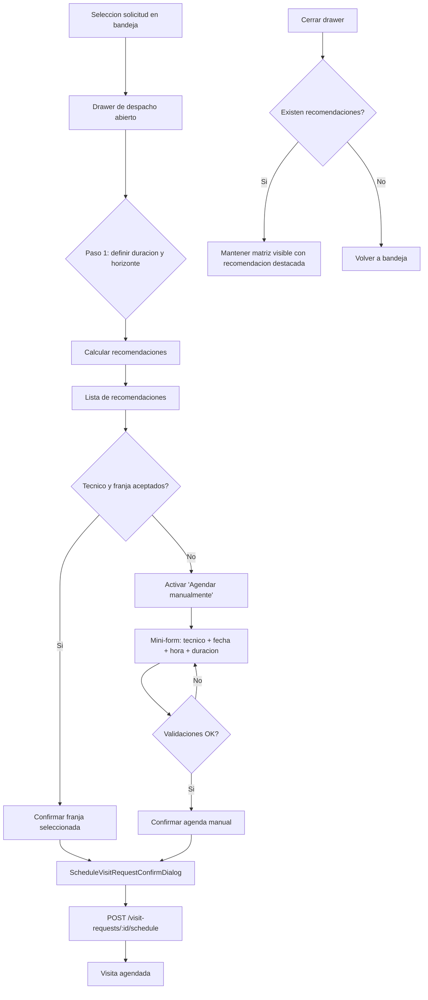

# SPEC: Agenda manual y persistencia del calendario en Despacho

**Version:** 1.0
**Estado:** Ejecutado — ver `docs/informes/INFORME-WFM-PENDING-VISITS-AGENDA-MANUAL-v1.0.md`
**Fecha:** 2026-06-06
**Modulo:** WFM Scheduling (Portal)
**Ruta:** /dashboard/scheduling/pending-visits
**Owner de ejecucion:** Sr. Dev Fullstack
**Reporta a:** EM + Architect Unificado
**Specs relacionadas:** SPEC-WFM-PENDING-VISITS-DESPACHO-VISUAL-v1.0.md, SPEC-WFM-PENDING-VISITS-ACTO-OPERATIVO-v1.0.md
**HLD rector:** docs/hlds/HLD-MOD09-PROGRAMACION-WFM-v1.0.md
**PRD rector:** docs/prds/PRD-MOD09-PROGRAMACION-WFM-v1.0.md

---

## 1. Objetivo

Cerrar dos brechas de cobertura UX detectadas en el flujo de despacho de la bandeja
`pending-visits`, sin modificar contrato API, modelo de datos ni boundaries de modulo:

1. El operador debe poder agendar una `VisitRequest` eligiendo libremente
   tecnico + fecha + hora, sin depender de las recomendaciones del algoritmo.
2. Al cerrar el drawer lateral de despacho, el calendario semanal
   (`WeeklyTechnicianMatrix`) debe permanecer visible con la solicitud ancla
   y la franja recomendada destacada, en lugar de forzar el regreso automatico
   a la bandeja izquierda.

El cambio es 100% de presentacion. El backend ya soporta agendamiento manual
sin recomendacion previa (verificado en `apps/api/src/modules/wfm/services/visit-requests.service.ts:509-574`)
y la idempotencia esta garantizada por el estado `SCHEDULED + scheduleEventId`.

## 2. Alcance

### 2.1 Incluye

1. Modificacion del handler `onClose` de `VisitRequestRecommendationPanel` en
   `apps/portal/src/components/scheduling/PendingVisitRequestsView.tsx` para
   preservar `recommendations`, `selectedRecommendationId` y `activeMode='matrix'`
   cuando existan recomendaciones calculadas.
2. Bloque toggleable "Agendar manualmente" dentro del Paso 1 del drawer, con
   mini-formulario inline:
   - Select de tecnico (fuente: `techniciansById` recibida por props).
   - DatePicker de fecha (default: ventana solicitada o inicio de la matriz).
   - Select de hora de inicio (fuente: `requestTimeOptions` ya calculado).
   - Input/Select de duracion (default: `durationMinutes` ya elegido).
   - Texto read-only de hora de fin calculada.
   - `PortalAlert` reusado de ventana operativa cuando aplique.
   - CTA "Confirmar agenda manual".
3. Handler `onConfirmManualSchedule` que reutiliza la misma transaccion
   `wfmApi.visitRequests.schedule(...)` y la misma cadena de post-confirmacion
   (linkWorkOrder, linkInstallationOperationalRefs, transitionExpedienteStatus)
   ya implementada en `PendingVisitRequestsView.tsx:1136-1196`.
4. Validaciones equivalentes a la recomendacion:
   - Solicitud no terminal.
   - `missingFields.length === 0` (contexto completo).
   - Tecnico seleccionado.
   - Hora de inicio dentro de `requestTimeOptions` y de la ventana operativa
     (cuando `workType === 'INSTALLATION'`).
   - `endAt - startAt >= 15 min` (regla backend, mensaje visible si falla).
5. Tests unitarios focalizados en `PendingVisitRequestsView.spec.tsx` y
   `VisitRequestRecommendationPanel.spec.tsx`.
6. Caso E2E adicional en `e2e/tests/portal-wfm-scheduling.spec.ts` cubriendo
   el flujo de agenda manual sin recomendacion previa.

### 2.2 No incluye (Fuera de alcance)

1. Cambios backend, DTOs, migraciones o seeds.
2. Nuevos endpoints o modificacion de los existentes.
3. Reutilizacion de `ScheduleEventForm` (verificado: layout incompatible con
   drawer 560px, submit a endpoint equivocado, refactor mayor no justificado).
4. Conversion de celdas de `WeeklyTechnicianMatrix` en superficie clickeable
   (queda como propuesta para Fase 2 explicita, ver seccion 13).
5. Drag-and-drop, resize de agenda o edicion inline de eventos existentes.
6. Cambio de patron de confirmacion: el `ScheduleVisitRequestConfirmDialog`
   actual sigue siendo la via de confirmacion; el mini-form manual alimenta
   ese mismo dialog con un `recommendation-like draft`.
7. Modificacion de `SPEC-WFM-PENDING-VISITS-DESPACHO-VISUAL-v1.0.md` o
   `SPEC-WFM-PENDING-VISITS-ACTO-OPERATIVO-v1.0.md`. Esta spec es complementaria.

## 3. Decision UX

### 3.1 Decision principal

1. El algoritmo de recomendaciones sigue siendo el camino dominante.
2. La agenda manual es una **salida secundaria explicita** visible siempre,
   no una alternativa paralela.
3. El calendario semanal permanece visible al cerrar el drawer como contexto
   del operador, no como modal separado.

### 3.2 Motivo

1. El operador promedio acepta la recomendacion en 7 de 10 casos
   (observacion cualitativa reportada por operaciones).
2. En los 3 casos restantes la friccion actual es alta: el operador debe
   cancelar el despacho y crear un evento suelto, perdiendo trazabilidad
   con la `VisitRequest` de origen.
3. Mantener el calendario visible al cerrar el drawer reduce el costo
   cognitivo de comparar la recomendacion con el resto de la semana.

### 3.3 Uso de modal

Sin cambios. El `ScheduleVisitRequestConfirmDialog` se mantiene para la
confirmacion final, alimentado tanto por una recomendacion del algoritmo
como por el mini-form manual.

## 4. Problema detectado

1. **Drawer descarta el calendario al cerrar.**
   `PendingVisitRequestsView.tsx:1108-1114` ejecuta `setActiveMode('inbox')`
   y `setRecommendations([])` de forma incondicional, perdiendo el contexto
   visual que el operador acaba de consultar.

2. **No existe opcion de agenda manual.**
   El Paso 1 solo expone "Calcular recomendaciones". El unico camino para
   una franja arbitraria es crear un `WfmScheduleEvent` suelto desde el
   boton "Nueva" del inbox, lo cual rompe la trazabilidad con la
   `VisitRequest` (no agenda la solicitud, crea un evento paralelo).

3. **Matriz es solo contexto visual.**
   `WeeklyTechnicianMatrix` no expone `onCellSelect` ni navegacion de semana.
   El operador no puede elegir un dia concreto sin pedir una recomendacion.

## 5. Arquitectura funcional objetivo

Reglas de composicion:

1. Un solo CTA dominante por intencion operativa.
2. "Calcular recomendaciones" sigue siendo el primario del Paso 1.
3. "Agendar manualmente" es CTA secundario visible y siempre habilitado
   cuando el contexto esta completo.
4. La matriz no compite con la bandeja: comparten layout, no foco.

## 6. Reglas de comportamiento e UI

### 6.1 Persistencia del calendario al cerrar

1. `setRecommendations([])` y `setSelectedRecommendationId(null)` se ejecutan
   **solo si** el drawer se cerro sin haber calculado recomendaciones.
2. `setActiveMode('inbox')` se ejecuta **solo si** no hay recomendaciones
   pendientes o la solicitud seleccionada cambia (en cuyo caso el efecto
   actual en lineas 697-702 ya resetea el estado).
3. Al reabrir el drawer sobre la misma solicitud, las recomendaciones se
   conservan visibles en la matriz y el panel las muestra sin recalcular.

### 6.2 Bloque "Agendar manualmente" en Paso 1

1. Render condicional detras de un toggle tipo `details/summary` o
   `Disclosure` (reutilizar primitive de `@iwana/ui` si existe; si no,
   `
` nativo con estilo consistente).
2. Default: colapsado.
3. Etiqueta visible: "Prefiero agendar manualmente".
4. Al expandir muestra un sub-formulario con los campos listados en 2.1.
5. El sub-formulario NO reemplaza al formulario de contexto ampliado (Paso 2);
   solo agrega un camino de salida del Paso 1.

### 6.3 Validaciones de UI para agenda manual

| Validacion | Mensaje visible |
|---|---|
| Falta contexto (direccion o municipio) | "Completa direccion y municipio antes de agendar manualmente." |
| Tecnico no seleccionado | "Selecciona un tecnico para continuar." |
| Fecha vacia o invalida | "Define una fecha valida para la agenda manual." |
| Hora de inicio vacia o invalida | "Define una hora de inicio valida para la agenda manual." |
| Hora de inicio fuera de opciones | "La hora seleccionada no esta dentro de la jornada operativa." |
| Ventana operativa cerrada | Reusar `PortalAlert` actual con `operatingWindowMessage`. |
| Duracion < 15 min | "La duracion minima es de 15 minutos." |

### 6.4 Reglas visuales

1. Mantener jerarquia: 1 superficie, 1 CTA por bloque.
2. Espaciado consistente con `SPEC-WFM-PENDING-VISITS-DESPACHO-VISUAL-v1.0.md`.
3. Tokens iWana; sin colores hardcodeados.
4. Foco visible en todos los controles.
5. Estado de loading alineado con el resto del drawer.

### 6.5 Vocabulario visible

Coordinar con `system-vocabulary-review`:

1. "Agendar manualmente" (no "Override", "Manual override", "Forzar agenda").
2. "Cerrar panel y conservar calendario" (cuando aplique tooltip).
3. Mantener "Franja" como termino operativo consistente con el resto del drawer.

## 7. Componentes a tocar

### 7.1 Portal scheduling

- `apps/portal/src/components/scheduling/PendingVisitRequestsView.tsx`
  - Handler `onClose` del `VisitRequestRecommendationPanel` (lineas 1108-1114).
  - Render del `WeeklyTechnicianMatrix` (lineas 1020-1029) ya no depende de
    `activeMode === 'matrix'` estricto: si hay `recommendations` y la solicitud
    sigue seleccionada, se mantiene.
- `apps/portal/src/components/scheduling/VisitRequestRecommendationPanel.tsx`
  - Nuevo prop opcional `onConfirmManualSchedule?: (payload) => Promise<void>`.
  - Nuevo estado local para el mini-form (tecnico, fecha, hora, duracion).
  - Nuevo bloque toggleable "Agendar manualmente" en Paso 1.
  - Reutilizar `useOperatingWindow`, `requestTimeOptions` y `PortalAlert`.
- `apps/portal/src/components/scheduling/PendingVisitRequestsView.tsx`
  - Implementar `onConfirmManualSchedule` reutilizando la misma transaccion
    que el `onConfirm` del `ScheduleVisitRequestConfirmDialog` (lineas 1136-1215).
  - Considerar extraer un helper `scheduleVisitRequestWithFollowUp(...)` para no duplicar
    la cadena de post-confirmacion (linkWorkOrder, linkInstallationOperationalRefs,
    transitionExpedienteStatus, syncExpedienteAfterScheduleEvent).

### 7.2 Pruebas

- `apps/portal/src/components/scheduling/PendingVisitRequestsView.spec.tsx`
  - Caso: cerrar drawer con recomendaciones mantiene `activeMode='matrix'`.
  - Caso: cerrar drawer sin recomendaciones vuelve a `activeMode='inbox'`.
- `apps/portal/src/components/scheduling/VisitRequestRecommendationPanel.spec.tsx`
  - Caso: toggle "Agendar manualmente" expande y colapsa el sub-formulario.
  - Caso: CTA "Confirmar agenda manual" envia el payload correcto al padre.
  - Caso: validaciones UI muestran mensajes esperados.
- `e2e/tests/portal-wfm-scheduling.spec.ts`
  - Caso E2E: agendar manualmente sin pasar por recomendacion.

## 8. Criterios de aceptacion

### 8.1 Funcionales

1. El operador puede agendar una `VisitRequest` eligiendo tecnico + fecha + hora
   desde el drawer, sin ejecutar "Calcular recomendaciones".
2. Al cerrar el drawer despues de calcular recomendaciones, la matriz semanal
   permanece visible y la franja recomendada sigue destacada.
3. Al cerrar el drawer sin haber calculado recomendaciones, la vista vuelve a
   la bandeja izquierda.
4. Al reabrir el drawer sobre la misma solicitud, las recomendaciones previas
   se mantienen sin recalcular.
5. El agendamiento manual respeta las mismas validaciones backend
   (ventana operativa, conflictos, duracion minima, idempotencia).

### 8.2 UX

1. "Calcular recomendaciones" sigue siendo el CTA dominante del Paso 1.
2. "Agendar manualmente" es visible sin saturar el Paso 1.
3. La matriz no compite visualmente con la bandeja.
4. El vocabulario visible cumple con `system-vocabulary-review`.

### 8.3 Accesibilidad

1. Foco visible en toggle, inputs y CTAs.
2. Navegacion por teclado operable (Escape cierra el drawer, Enter submitea
   el sub-formulario).
3. Contraste WCAG AA en los nuevos elementos.
4. `aria-expanded` y `aria-controls` en el toggle del sub-formulario.

## 9. Validacion requerida

1. `pnpm --filter @iwana/portal test -- PendingVisitRequestsView.spec.tsx` en verde.
2. `pnpm --filter @iwana/portal test -- VisitRequestRecommendationPanel.spec.tsx` en verde.
3. `pnpm exec playwright test --config e2e/playwright.portal.config.ts e2e/tests/portal-wfm-scheduling.spec.ts` en verde con caso nuevo.
4. `pnpm lint` en verde.
5. `pnpm typecheck` en verde.
6. Verificacion manual en `http://localhost:3002/dashboard/scheduling/pending-visits`:
   - Calcular recomendaciones, cerrar drawer, verificar matriz visible.
   - Expandir "Agendar manualmente", diligenciar y agendar.

## 10. Riesgos y mitigacion

| Riesgo | Mitigacion |
|---|---|
| Densidad visual del Paso 1 crece | Toggle colapsable por defecto; mismo radio `rounded-2xl` y espaciado `space-y-3` ya definido |
| Vocabulario "manual" compite con recomendacion | Coordinar copy con `system-vocabulary-review`; tono operativo, no tecnico |
| Regresion al cerrar drawer | Tests focalizados cubren el caso `activeMode='matrix'` post-cierre |
| Duplicacion de logica de schedule | Extraer helper `scheduleVisitRequestWithFollowUp(...)` en `PendingVisitRequestsView`; tests unitarios del helper |
| Idempotencia rota | El backend ya es idempotente; los tests deben cubrir el caso `SCHEDULED` con segundo schedule |

## 11. Plan de ejecucion (resumen)

El detalle de tareas, archivos y criterios esta en
`docs/plans/2026-06-06-mod09-pending-visits-agenda-manual.md`.

## 12. Definition of Done

- [ ] Criterios de aceptacion funcionales, UX y accesibilidad cumplidos.
- [ ] Tests unit + e2e en verde.
- [ ] Lint y typecheck en verde.
- [ ] Sin PII, sin secretos, sin logs sensibles.
- [ ] Informe de fase creado en `docs/informes/INFORME-WFM-PENDING-VISITS-AGENDA-MANUAL-v1.0.md` con evidencia visual y funcional.
- [ ] Spec vivo actualizado a `Ejecutado` al cierre.
- [ ] PR con dos commits minimo: (1) persistencia de matriz, (2) mini-form manual.

## 13. Futuras fases (fuera de alcance)

1. **Fase 2 — Matriz interactiva:** agregar `onCellSelect` a
   `WeeklyTechnicianMatrix`, hacer celdas clickeables con `role="button"`,
   `tabIndex={0}` y handlers de teclado.
2. **Fase 2 — Navegacion de semana:** selector de rango en la matriz
   desacoplado de `requestedWindowStartAt`.
3. **Fase 2 — Drag-and-drop:** mover eventos entre celdas para reagendar
   sin pasar por el drawer.
4. **Fase 3 — Sugerencias contextuales:** "este tecnico suele tener baja
   carga los viernes" como ayuda a la decision.

## 14. Referencias

1. `AGENTS.md`
2. `docs/roles/_historico/Perfil_IA_EM_Architect_Unificado_v1.md`
3. `docs/prds/PRD-MOD09-PROGRAMACION-WFM-v1.0.md`
4. `docs/hlds/HLD-MOD09-PROGRAMACION-WFM-v1.0.md`
5. `docs/adrs/ADR-037-Bounded-Context-Programacion-WFM.md`
6. `docs/adrs/ADR-039-Bandeja-Visitas-Pendientes-WFM.md`
7. `docs/specs/SPEC-WFM-PENDING-VISITS-DESPACHO-VISUAL-v1.0.md`
8. `docs/specs/SPEC-WFM-PENDING-VISITS-ACTO-OPERATIVO-v1.0.md`
9. `docs/informes/INFORME-WFM-PENDING-VISITS-DESPACHO-VISUAL-v1.0.md`
10. `apps/portal/src/components/scheduling/PendingVisitRequestsView.tsx`
11. `apps/portal/src/components/scheduling/VisitRequestRecommendationPanel.tsx`
12. `apps/portal/src/components/scheduling/WeeklyTechnicianMatrix.tsx`
13. `apps/api/src/modules/wfm/services/visit-requests.service.ts`
14. `apps/api/src/modules/wfm/dto/schedule-visit-request.dto.ts`
