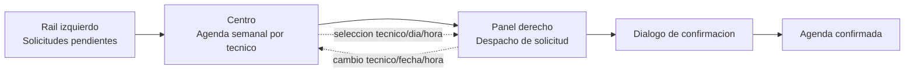

# SPEC: Workspace calendar-first para pending visits

**Version:** 1.0  
**Estado:** Listo para ejecucion  
**Fecha:** 2026-06-09  
**Modulo:** WFM Scheduling (Portal)  
**Ruta:** /dashboard/scheduling/pending-visits  
**Owner de ejecucion:** Sr. Dev Fullstack  
**Reporta a:** EM + Architect Unificado  
**Specs relacionadas:** SPEC-WFM-PENDING-VISITS-ACTO-OPERATIVO-v1.0.md, SPEC-WFM-PENDING-VISITS-DESPACHO-VISUAL-v1.0.md, SPEC-WFM-PENDING-VISITS-AGENDA-MANUAL-v1.0.md  
**HLD rector:** docs/hlds/HLD-MOD09-PROGRAMACION-WFM-v1.0.md  
**PRD rector:** docs/prds/PRD-MOD09-PROGRAMACION-WFM-v1.0.md

---

## 1. Objetivo

Rediseñar `pending-visits` como un workspace operativo calendar-first, inspirado en patrones de Google Calendar y Notion Calendar, sin romper el modelo de negocio actual de iWana:

1. La solicitud pendiente sigue siendo el objeto principal.
2. La agenda visible pasa a ser la superficie dominante de decision.
3. El operador puede seleccionar tecnico, dia y hora desde la vista central sin depender solo de la recomendacion global.
4. La confirmacion final, las advertencias y la creacion efectiva de la agenda siguen centralizadas en el panel de despacho y en la confirmacion existente.

La meta no es “hacer un calendario generico”, sino convertir la programacion de visitas pendientes en un acto operativo mas directo, comparable, visual y trazable.

## 2. Decision de producto

Se aprueba una evolucion de la ruta actual hacia un **workspace de tres bandas persistentes**:

1. **Rail izquierdo:** bandeja compacta de solicitudes pendientes.
2. **Centro:** agenda semanal operativa por tecnico con capacidad seleccionable.
3. **Panel derecho:** inspector persistente de despacho y confirmacion.

Decision explicitamente aprobada para esta iteracion:

1. El flujo sera **click-to-schedule**, no drag-and-drop.
2. La agenda semanal visible seguira trabajando sobre **los 7 dias ya expuestos**.
3. La matriz actual deja de ser solo informativa y se convierte en una superficie de seleccion operacional.
4. No se crea un segundo flujo de agenda paralelo; el panel derecho sigue siendo el unico punto de confirmacion final.

## 3. Problema actual

La version actual presenta tres fricciones estructurales:

1. La agenda aparece como contexto secundario, no como superficie primaria de trabajo.
2. La seleccion de franja depende demasiado de la recomendacion del sistema y obliga al operador a salir del flujo cuando necesita una eleccion puntual.
3. El layout actual separa bandeja, matriz y despacho como pasos casi secuenciales, cuando la necesidad real es comparar, decidir y confirmar con contexto persistente.

Resultado observado:

1. Mayor costo cognitivo para comparar tecnicos y dias.
2. Menor control manual en casos operativos excepcionales.
3. Sensacion visual de tabla consultiva en lugar de centro de agendamiento.

## 4. Alcance

### 4.1 Incluye

1. Reestructuracion completa del layout de `PendingVisitRequestsView` hacia tres bandas persistentes.
2. Evolucion de `WeeklyTechnicianMatrix` hacia una agenda semanal seleccionable y sincronizada con el panel.
3. Estado compartido para representar una seleccion manual desde la agenda.
4. Sincronizacion bidireccional entre agenda central y panel derecho.
5. Refinamiento visual de bordes, radios, jerarquia y densidad para alinear la seccion con la identidad iWana.
6. Advertencias UX previas para riesgo operativo, falta de disponibilidad explicita y hora manual fuera de ventana.
7. Ajustes de pruebas unitarias y E2E sobre el nuevo flujo.

### 4.2 No incluye

1. Cambios de contrato backend.
2. Drag-and-drop o resize de eventos.
3. Cambio de horizonte mas alla de 7 dias.
4. Reemplazo del dialogo de confirmacion por otro patron.
5. Rediseño de `schedule` general fuera de `pending-visits`.
6. Nueva logica de recomendacion algoritmica.

## 5. Principios UX rectores

Inspiracion funcional:

1. **Google Calendar:** foco en tiempo y comparacion rapida.
2. **Notion Calendar:** claridad de seleccion y detalle contextual sin romper el workspace.

Adaptacion iWana:

1. La experiencia debe sentirse operacional B2B, no de consumo masivo.
2. El calendario no puede “decorar”; debe ayudar a decidir.
3. El color no sera el unico portador de estado.
4. Riesgo operativo se advierte, pero no bloquea por defecto.
5. La accion principal debe ser siempre evidente: elegir y confirmar una agenda valida para una solicitud concreta.

## 6. Arquitectura de experiencia objetivo



### 6.1 Rail izquierdo

Funcion:

1. Mostrar solicitudes pendientes en formato compacto.
2. Mantener seleccion visible.
3. Permitir cambiar rapidamente de solicitud sin abandonar el workspace.

Reglas:

1. Menos densidad que una tabla tradicional.
2. Cards o filas compactas con estado, direccion resumida, ventana y antiguedad.
3. Scroll independiente del centro y del panel derecho.

### 6.2 Centro

Funcion:

1. Ser la superficie principal de comparacion y eleccion.
2. Permitir seleccionar tecnico, dia y franja sugerida o manual.
3. Exponer riesgo operativo de manera legible.

### 6.3 Panel derecho

Funcion:

1. Mostrar el resumen de la solicitud activa.
2. Mostrar el resumen de la seleccion hecha en la agenda.
3. Consolidar advertencias, formulario manual y CTA de confirmacion.

## 7. Decision de layout y composicion

### 7.1 Desktop

Distribucion recomendada:

1. Rail izquierdo: 320-360 px.
2. Centro: flexible y dominante.
3. Panel derecho: 380-440 px.

### 7.2 Tablet

1. Rail izquierdo colapsable.
2. Centro como lienzo principal.
3. Panel derecho en drawer persistente o columna secundaria segun ancho disponible.

### 7.3 Mobile

1. Se degrada a flujo por pasos.
2. Primero solicitud, luego agenda, luego confirmacion.
3. No se exige replicar la composicion de tres columnas en pantallas pequenas.

## 8. Evolucion funcional de la agenda central

`WeeklyTechnicianMatrix` debe evolucionar desde una tabla densa a una **agenda semanal operativa**. Si tecnicamente conviene renombrarla durante la implementacion, el nombre recomendado es `PendingVisitsCapacityBoard`.

### 8.1 Estados por celda

Cada interseccion tecnico/dia debe soportar:

1. `informativa`
2. `seleccionada`
3. `riesgo`

Los estados deben expresarse con:

1. borde
2. fondo
3. icono o etiqueta corta
4. foco visible

No depender solo del color.

### 8.2 Interacciones requeridas

1. Click en celda: selecciona `technicianId + date`.
2. Click en franja sugerida dentro de la celda: selecciona `startTime + duration` con `source='recommendation'`.
3. Accion “definir hora manual”: abre selector liviano de hora para ese tecnico/dia.
4. Navegacion por teclado entre celdas.
5. `Enter` o `Space` sobre celda enfocada debe poder activar la seleccion.

### 8.3 Informacion visible por celda

Minimo visible:

1. estado del dia
2. indicador de disponibilidad explicita o ausencia de ella
3. franja recomendada principal si existe
4. advertencia operativa si requiere validacion

No debe verse como una malla de bordes duros o tabla legacy. La composicion debe usar divisiones suaves, radios consistentes y una jerarquia mas cercana a calendario operativo que a spreadsheet.

## 9. Estado compartido y sincronizacion

`PendingVisitRequestsView` pasa a ser la fuente de verdad del estado compartido entre bandeja, agenda y panel.

### 9.1 Draft de seleccion

Se define un draft comun:

```ts
type PendingVisitScheduleDraft = {
  technicianId: string | null;
  date: string | null;
  startTime: string | null;
  duration: number | null;
  source: 'recommendation' | 'manual' | null;
};
```

### 9.2 Reglas de sincronizacion

1. Si el usuario selecciona una celda en la agenda, el panel derecho se precarga.
2. Si el usuario cambia tecnico, fecha u hora desde el panel, la agenda refleja la seleccion.
3. Si el usuario cambia de solicitud en el rail izquierdo, el draft se resetea de forma segura.
4. Cerrar y reabrir el panel no debe dejar estados huerfanos ni selecciones invisibles.

## 10. Ajustes al panel derecho

`VisitRequestRecommendationPanel` debe aceptar dos modos de entrada:

1. recomendaciones globales calculadas
2. seleccion puntual proveniente de la agenda central

### 10.1 Bloque superior nuevo

Cuando la seleccion venga desde la agenda, mostrar arriba:

1. tecnico elegido
2. dia elegido
3. hora elegida o franja elegida
4. estado operativo del dia
5. si la seleccion fue sugerida o manual

### 10.2 Seccion manual

1. Debe iniciar abierta o semiprecargada cuando la seleccion venga desde la agenda.
2. Debe convivir con la lista de sugerencias del dia.
3. Debe permitir ajustar hora y duracion sin romper la relacion con la solicitud activa.

### 10.3 Confirmacion

Sin cambios de contrato:

1. `ScheduleVisitRequestConfirmDialog` sigue siendo el ultimo gate.
2. Backend sigue siendo el arbitro final de disponibilidad real.
3. El frontend solo promete “seleccion operativa tentativa” hasta obtener respuesta OK.

## 11. Reglas de validacion y advertencia

Mantener validaciones backend existentes:

1. conflicto de agenda por tecnico
2. ventana operativa para instalaciones
3. duracion minima de 15 minutos

Agregar validacion UX previa:

1. advertencia si la hora manual cae fuera de ventana operativa
2. advertencia si la celda tenia bloqueo o sin disponibilidad explicita
3. advertencia si la franja elegida no proviene de recomendacion

Las advertencias deben ser claras, visibles y no ambiguas. No deben formularse como confirmaciones catastroficas ni como bloqueos absolutos si el backend aun permite continuar.

## 12. Lineamientos visuales iWana

Esta iteracion debe corregir el principal drift visual detectado en la seccion: **los bordes y divisiones no conservan el lenguaje del sistema**.

### 12.1 Reglas visuales obligatorias

1. Un solo contenedor exterior con `rounded-2xl` y borde suave del sistema.
2. Encabezado y cuerpo integrados, sin efecto de “tabla incrustada dentro de otra tabla”.
3. Divisiones internas con contraste bajo y consistencia semantica.
4. Estados de seleccion con borde mas fuerte y fondo sutil, sin glow agresivo.
5. Estados de riesgo con apoyo de iconografia o copy, no solo tono.
6. Chips de recomendacion con radios, altura y borde alineados a primitives del portal.
7. Evitar bordes beige o cajas que parezcan heredadas de un spreadsheet.

### 12.2 Referencia interna de identidad

La ejecucion debe apoyarse en:

1. `apps/portal/src/components/shared/portal-ui.tsx`
2. `packages/ui/src/styles/globals.css`
3. `docs/identity/Manual_Implementacion_Identidad_Iwana.md`

## 13. Arquitectura tecnica sugerida

### 13.1 Componentes principales a intervenir

1. `apps/portal/src/components/scheduling/PendingVisitRequestsView.tsx`
2. `apps/portal/src/components/scheduling/WeeklyTechnicianMatrix.tsx`
3. `apps/portal/src/components/scheduling/VisitRequestRecommendationPanel.tsx`
4. `apps/portal/src/components/scheduling/ScheduleVisitRequestConfirmDialog.tsx`
5. `apps/portal/src/components/scheduling/PendingVisitRequestInbox.tsx`

### 13.2 Direccion de refactor

1. Mantener `PendingVisitRequestsView` como orquestador.
2. Extraer el estado compartido a hooks o helpers locales si el archivo crece demasiado.
3. Separar rendering del centro en un componente dedicado si la complejidad visual sube.
4. Reutilizar primitives del portal antes de crear wrappers nuevos.

### 13.3 Backend

No se requiere cambio obligatorio de API para esta iteracion.

Si durante la implementacion el equipo detecta que la agenda central necesita datos mas ricos por tecnico/dia/hora para evitar sobrecarga frontend, se permite proponer una fase posterior con endpoint agregador, pero eso no forma parte del alcance aprobado de esta spec.

## 14. Estrategia de implementacion recomendada

### Fase 1. Orquestacion y layout

1. Convertir la vista en workspace de tres bandas.
2. Mantener funcionalidad actual estable.
3. Reubicar la bandeja y el panel sin romper el flujo.

### Fase 2. Agenda seleccionable

1. Introducir seleccion de celda y de franja.
2. Incorporar estados visuales `informativa`, `seleccionada`, `riesgo`.
3. Sincronizar con draft compartido.

### Fase 3. Panel sincronizado

1. Ajustar `VisitRequestRecommendationPanel`.
2. Consolidar resumen de seleccion desde agenda.
3. Mantener dialogo final de confirmacion.

### Fase 4. Hardening

1. Ajustes de accesibilidad.
2. Ajustes de bordes, spacing y contraste.
3. Pruebas y estabilizacion E2E.

## 15. Criterios de aceptacion

### Funcionales

1. El operador puede seleccionar una solicitud y agendarla desde la agenda central.
2. El operador puede escoger tecnico, dia y hora puntual sin depender exclusivamente de la recomendacion global.
3. El panel derecho refleja cualquier cambio hecho desde la agenda.
4. Si el operador cambia tecnico o fecha desde el panel, la agenda actualiza la seleccion visible.
5. La confirmacion final sigue usando el flujo actual y respeta validaciones backend existentes.

### Visuales

1. La seccion se percibe como centro de agendamiento, no como tabla consultiva.
2. Los bordes, radios y divisiones quedan alineados con el sistema iWana.
3. La seleccion activa es evidente sin depender solo del color.
4. La densidad general mejora respecto a la matriz actual.

### Accesibilidad

1. Foco visible en celdas y controles.
2. Navegacion por teclado funcional en la agenda.
3. Riesgo y seleccion no dependen solo del color.

## 16. Plan minimo de pruebas

### Unitarias

1. Seleccionar una celda con recomendacion precarga draft correcto.
2. Seleccionar una celda y cambiar a hora manual actualiza draft.
3. Cambiar tecnico o fecha desde el panel sincroniza la agenda.
4. Cerrar y reabrir panel limpia estados temporales sin inconsistencia.

### E2E

1. Seleccionar solicitud, elegir franja sugerida desde agenda y confirmar.
2. Seleccionar solicitud, elegir tecnico/dia y ajustar hora manual.
3. Continuar con advertencia cuando no hay disponibilidad explicita.
4. Recibir error backend por conflicto y mostrarlo correctamente.
5. Ver advertencia de ventana operativa fuera de rango antes de confirmar.

## 17. Riesgos y mitigacion

1. Riesgo: `PendingVisitRequestsView` concentre demasiada complejidad.
   Mitigacion: extraer hooks de sincronizacion y componentes de layout.
2. Riesgo: la agenda siga pareciendo tabla aunque cambie la funcionalidad.
   Mitigacion: revisar bordes, radios, jerarquia y microcopy antes de cerrar.
3. Riesgo: regresiones entre recomendaciones globales y seleccion manual.
   Mitigacion: pruebas unitarias y E2E cubriendo ambos caminos.
4. Riesgo: ambiguedad de seleccion si la solicitud cambia mientras el draft sigue vivo.
   Mitigacion: reset controlado al cambiar solicitud.

## 18. Definition of done

1. Workspace de tres bandas funcionando en desktop.
2. Agenda central seleccionable y sincronizada con panel.
3. Bordes y divisiones alineados con identidad iWana.
4. Validaciones UX previas implementadas sin romper el contrato backend.
5. Suite relevante de tests actualizada y en verde.
6. Informe de ejecucion actualizado en `docs/informes/`.

## 19. Referencias

1. [docs/hlds/HLD-MOD09-PROGRAMACION-WFM-v1.0.md](/home/sley/Documentos/appiw/docs/hlds/HLD-MOD09-PROGRAMACION-WFM-v1.0.md)
2. [docs/specs/SPEC-WFM-PENDING-VISITS-ACTO-OPERATIVO-v1.0.md](/home/sley/Documentos/appiw/docs/specs/SPEC-WFM-PENDING-VISITS-ACTO-OPERATIVO-v1.0.md)
3. [docs/specs/SPEC-WFM-PENDING-VISITS-DESPACHO-VISUAL-v1.0.md](/home/sley/Documentos/appiw/docs/specs/SPEC-WFM-PENDING-VISITS-DESPACHO-VISUAL-v1.0.md)
4. [docs/specs/SPEC-WFM-PENDING-VISITS-AGENDA-MANUAL-v1.0.md](/home/sley/Documentos/appiw/docs/specs/SPEC-WFM-PENDING-VISITS-AGENDA-MANUAL-v1.0.md)
5. [apps/portal/src/components/scheduling/PendingVisitRequestsView.tsx](/home/sley/Documentos/appiw/apps/portal/src/components/scheduling/PendingVisitRequestsView.tsx)
6. [apps/portal/src/components/scheduling/WeeklyTechnicianMatrix.tsx](/home/sley/Documentos/appiw/apps/portal/src/components/scheduling/WeeklyTechnicianMatrix.tsx)
7. [apps/portal/src/components/scheduling/VisitRequestRecommendationPanel.tsx](/home/sley/Documentos/appiw/apps/portal/src/components/scheduling/VisitRequestRecommendationPanel.tsx)
