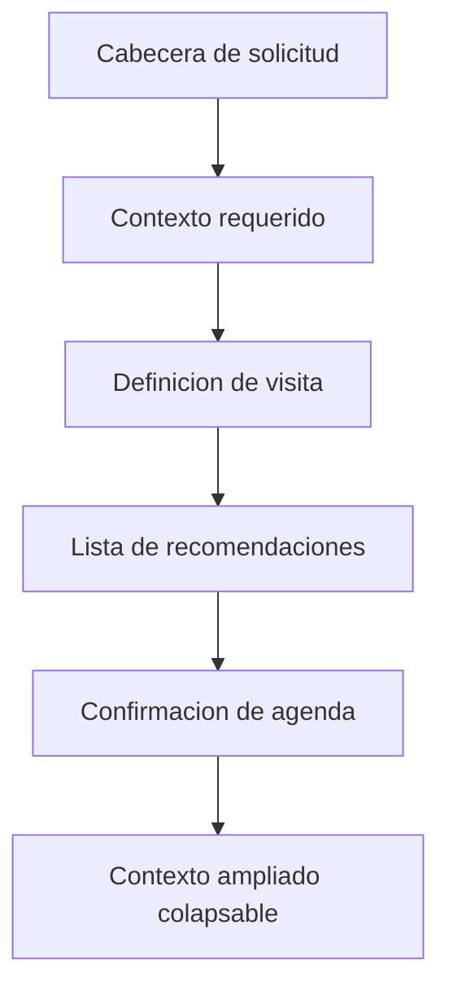

# SPEC: Refinamiento visual del bloque Despacho de la solicitud

**Version:** 1.0  
**Estado:** Ejecutado  
**Fecha:** 2026-06-04  
**Modulo:** WFM Scheduling (Portal)  
**Ruta:** /dashboard/scheduling/pending-visits  
**Owner de ejecucion:** Sr. Dev Fullstack

## 1. Objetivo

Reducir ruido visual y densidad en el bloque "Despacho de la solicitud" para que el operador pueda:

1. Entender estado y contexto en menos de 5 segundos.
2. Seleccionar recomendacion sin friccion visual.
3. Confirmar agenda sin desplazamiento innecesario.

Sin cambiar reglas de negocio, contratos API, ni flujo funcional.

## 2. Alcance

### Incluye

1. Simplificacion de tarjetas y contenedores en el panel derecho.
2. Unificacion de espaciado vertical y horizontal.
3. Reduccion de elementos repetidos en recomendaciones.
4. Ajuste de jerarquia visual entre contexto, recomendacion y confirmacion.
5. Ajustes de copy corto en ayudas operativas del panel.

### No incluye

1. Cambios backend o DTOs.
2. Cambios de permisos, roles o reglas de asignacion.
3. Rediseño de la bandeja izquierda.
4. Cambio de arquitectura inline a modal o pestana.

## 3. Decision UX

Se mantiene el acto operativo inline dentro de la ruta actual.

1. No mover Despacho a modal principal.
2. No mover Despacho a pestana separada.
3. Mantener la secuencia actual: contexto -> recomendacion -> confirmacion.

## 4. Problemas detectados

1. Exceso de superficies anidadas en el resumen de solicitud.
2. Contenedores repetidos para la ventana operativa.
3. Uso excesivo de badges en items de recomendacion.
4. Escala de espaciado inconsistente entre bloques.
5. Mensajeria de ayuda de Paso 1 con baja escaneabilidad.

## 5. Arquitectura visual objetivo

Regla de composicion:

1. Maximo 2 niveles de superficies visibles.
2. Un solo bloque principal por intencion operativa.
3. Una accion primaria dominante por tramo.

## 6. Reglas de UI a implementar

### 6.1 Tarjetas y contenedores

1. Cabecera: una sola superficie `rounded-2xl border p-5`.
2. Eliminar subtarjetas internas de direccion, territorio y nota.
3. Reemplazar subtarjetas por filas con separador suave `border-t`.
4. Mantener `PortalAlert` para alertas, sin wrappers extra.

### 6.2 Lista de recomendaciones

1. Reducir cada item a 3 lineas utiles:
   - Linea 1: tecnico + puntuacion.
   - Linea 2: rango horario.
   - Linea 3: distancia, carga, etiquetas en texto compacto.
2. Remover badges secundarios de etiquetas dinamicas.
3. Puntuacion en texto inline, no badge adicional.
4. Estado seleccionado con `border-emerald-500 bg-emerald-50`.

### 6.3 Espaciado

1. Entre bloques principales: `space-y-4`.
2. Dentro de bloque: `gap-2` o `gap-3`.
3. Separaciones internas verticales: `mt-2` y `mt-4`.
4. Evitar `gap-5` y `mt-5` en este panel.

### 6.4 Colapsables y microinteraccion

1. Trigger con `aria-expanded` y `aria-controls`.
2. Foco visible consistente en botones y selects.
3. Transiciones cortas `duration-150` o `duration-200`.
4. Evitar animaciones decorativas largas.

### 6.5 Vocabulario visible

1. No usar terminos en ingles en copy visible si existe equivalente claro.
2. Mantener texto orientado a accion operativa.
3. Mensajes de ayuda en frase corta y accionable.

## 7. Archivo principal a intervenir

1. apps/portal/src/components/scheduling/VisitRequestRecommendationPanel.tsx

Archivos potencialmente impactados:

1. apps/portal/src/components/scheduling/PendingVisitRequestsView.tsx
2. apps/portal/src/components/scheduling/ScheduleVisitRequestConfirmDialog.tsx
3. apps/portal/src/components/scheduling/*.spec.tsx
4. e2e/tests/portal-wfm-scheduling.spec.ts

## 8. Criterios de aceptacion

### Visual

1. El panel derecho reduce altura perceptual y ruido visual.
2. Se elimina duplicacion de tarjetas en resumen.
3. Recomendaciones se leen en escaneo rapido.
4. Accion principal de confirmacion destaca sobre auxiliares.

### Funcional

1. Flujo actual se mantiene sin regresion:
   - completar contexto,
   - calcular recomendacion,
   - seleccionar,
   - confirmar agenda.
2. Persisten estados y validaciones actuales.
3. No se rompen callbacks ni contratos de props.

### Accesibilidad

1. Foco visible en todos los controles interactivos.
2. Navegacion por teclado operable en todo el panel.
3. Contraste de textos y estados en nivel AA.

## 9. Plan de ejecucion fullstack

1. Aplanar cabecera y resumen de solicitud.
2. Compactar item de recomendacion y reducir badges.
3. Unificar espaciado por escala definida.
4. Simplificar bloque de ventana comprometida.
5. Afinar colapsable de contexto operativo.
6. Ajustar tests por cambios de estructura y copy.
7. Validar unit + e2e de scheduling.

## 10. Validacion requerida

1. `pnpm --filter @iwana/portal test -- PendingVisitRequestsView.spec.tsx`
2. `pnpm exec playwright test --config e2e/playwright.portal.config.ts e2e/tests/portal-wfm-scheduling.spec.ts`

## 11. Riesgos y mitigacion

1. Riesgo: cambios visuales alteran selectores de prueba.
   - Mitigacion: usar selectores estables por rol y texto semantico.
2. Riesgo: compactacion excesiva reduce claridad.
   - Mitigacion: revisar lectura con datos largos y casos edge.
3. Riesgo: inconsistencias dark mode.
   - Mitigacion: validar tokens en modo claro y oscuro.

## 12. Definicion de terminado

1. Criterios de aceptacion visual, funcional y accesibilidad cumplidos.
2. Suite de pruebas relevante en verde.
3. Spec actualizado si hay ajuste de alcance durante ejecucion.
4. Informe vivo de ejecucion actualizado en docs/informes.

## 13. Referencias

1. docs/specs/SPEC-WFM-PENDING-VISITS-ACTO-OPERATIVO-v1.0.md
2. docs/informes/INFORME-WFM-PENDING-VISITS-ACTO-OPERATIVO-v1.0.md
3. apps/portal/src/components/scheduling/VisitRequestRecommendationPanel.tsx
4. apps/portal/src/components/scheduling/PendingVisitRequestsView.tsx
5. docs/runbooks/RUNBOOK-PORTAL-Z-INDEX-CAPAS-v1.0.md

## 14. Estado de ejecucion

1. Cabecera de solicitud simplificada a una sola superficie, sin subtarjetas internas.
2. Tarjetas de recomendacion compactadas con puntuacion inline y etiquetas en texto compacto.
3. Espaciado unificado en bloques principales y secciones internas.
4. Bloque de contexto ajustado con contenedor mas sobrio para ventana comprometida.
5. Validacion completada con unit y e2e en verde.
6. Variante aplicada: panel lateral tipo drawer con fondo atenuado, cierre explicito y accion primaria fija al pie.

## 15. Evidencia de validacion

1. `pnpm --filter @iwana/portal test -- PendingVisitRequestsView.spec.tsx` -> 9 passed.
2. `pnpm exec playwright test --config e2e/playwright.portal.config.ts e2e/tests/portal-wfm-scheduling.spec.ts` -> 9 passed.
