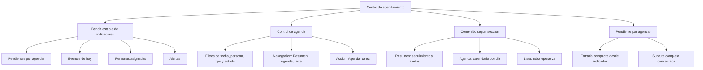

# SPEC: Centro de agendamiento WFM con glass operativo

**Version:** 1.0  
**Estado:** Completado  
**Fecha:** 2026-06-05  
**Modulo:** WFM Scheduling (Portal)  
**Ruta principal:** `/dashboard/scheduling`  
**Ruta relacionada:** `/dashboard/scheduling/pending-visits`  
**Owner de ejecucion:** Sr. Dev Fullstack  
**Fuente de auditoria:** Auditoria UX/UI de Scheduling, capturas de estado Centro operativo/Calendario y revision de identidad iWana.

---

## 1. Objetivo

Convertir `/dashboard/scheduling` en un centro de agendamiento facil de entender y operar para un usuario promedio, manteniendo el caracter visual premium de iWana con glass, gradientes suaves y profundidad controlada.

El usuario debe poder responder rapidamente:

1. Que falta por agendar.
2. Que ya esta agendado.
3. Quien tiene trabajo asignado.
4. Que alertas requieren atencion.
5. Donde crear o confirmar una tarea.

La mejora no busca quitar glass ni gradientes. Busca que ese lenguaje visual sea consistente, operativo y estable entre secciones.

---

## 2. Problema detectado

### 2.1 Cambio de tarjetas entre secciones

En la vista actual, al alternar entre `Centro operativo`, `Calendario` y `Lista`, cambia el set superior de tarjetas:

| Vista | Componente actual | Tarjetas visibles | Problema |
| --- | --- | --- | --- |
| Centro operativo | `SchedulingKpiSection` | 6 tarjetas: Activos, Atrasados, Proximos 7 dias, En ruta, En riesgo, Bandeja pendiente | Da lectura completa, pero ocupa mucho espacio y no se mantiene al cambiar de seccion. |
| Calendario / Lista | `MetricCard` local en `SchedulingClient` | 4 tarjetas: Agenda, Backlog, Horizonte, Capacidad | Cambia nombres, cantidad, narrativa y estilo perceptual. |

Efecto para el usuario:

1. La pantalla parece cambiar de identidad al cambiar de seccion.
2. Los indicadores que estaba leyendo desaparecen o se renombran.
3. El usuario siente que entra a otro dashboard, no a otra vista del mismo centro.
4. La bandeja pendiente pierde protagonismo justo cuando el usuario esta revisando agenda o lista.

### 2.2 Exceso de conceptos visibles

El modulo expone demasiados conceptos al mismo nivel:

1. Evento.
2. Solicitud pendiente.
3. Orden de trabajo.
4. Franja operativa.
5. Timeline diario.
6. Centro operativo.
7. Calendario.
8. Lista.
9. Bandeja pendiente.
10. Crear evento.

La experiencia objetivo debe agruparlos en un modelo mental mas simple:

1. `Pendiente por agendar`: solicitudes que necesitan datos, asignacion o confirmacion.
2. `Agenda`: tareas ya asignadas a una persona, fecha y horario.
3. `Seguimiento`: estado, alertas y carga por persona.

---

## 3. Resultado esperado

1. La ruta `/dashboard/scheduling` se presenta como `Centro de agendamiento`.
2. La banda superior de indicadores es estable en todas las secciones.
3. Las tarjetas superiores usan un patron visual unico con glass operativo y gradientes suaves.
4. La navegacion se simplifica a `Resumen`, `Agenda` y `Lista`.
5. La bandeja pendiente queda integrada como entrada natural del centro, sin romper la subruta existente.
6. El boton principal pasa de `Crear evento` a `Agendar tarea`.
7. El formulario de creacion se reorganiza por bloques de decision, sin cambiar contratos backend.
8. Calendario, timeline y lista reutilizan primitives locales para tarjetas y badges de scheduling.

---

## 4. Alcance

### Incluye

1. Redisenar el primer viewport de `/dashboard/scheduling`.
2. Crear una banda estable de indicadores `SchedulingSummaryStrip`.
3. Mantener y refinar glass/gradientes en tarjetas y contenedores.
4. Ajustar copy visible a vocabulario amable y operativo.
5. Reorganizar la navegacion de vistas.
6. Integrar entrada compacta a pendientes dentro del centro principal.
7. Mantener compatibilidad de `/dashboard/scheduling/pending-visits`.
8. Crear primitives locales de scheduling para reducir tarjetas duplicadas.
9. Ajustar pruebas unitarias y E2E afectadas.

### No incluye

1. Cambios de permisos o roles.
2. Migraciones de base de datos.
3. Nuevos endpoints backend obligatorios.
4. Cambios en aislamiento tenant o tenancy.
5. Drag-and-drop, Gantt avanzado o planificador por mapa.
6. Cambio de stack visual o nuevas dependencias.
7. Reescritura completa de `SchedulingClient` en el mismo PR.

---

## 5. Decisiones de producto y UX

| Decision | Definicion |
| --- | --- |
| Nombre de pagina | `Centro de agendamiento`. |
| Accion primaria | `Agendar tarea`. |
| Solicitudes pendientes | Mostrar como `Pendiente por agendar`. |
| Eventos ya creados | Mostrar como `Agenda` o `Eventos agendados` segun contexto. |
| Vista command center | Renombrar a `Resumen`. |
| Vista calendar | Renombrar a `Agenda`. |
| Vista list | Mantener como `Lista`. |
| Reagendar | Mantener como accion especifica para mover fecha u horario. |
| Bandeja pendiente | Mantener subruta, pero no tratarla como app separada. |

---

## 6. Arquitectura de informacion objetivo



Regla principal:

1. La banda de indicadores no cambia al alternar seccion.
2. Solo cambia el contenido bajo el control de agenda.
3. La accion primaria se mantiene visible y consistente.

---

## 7. Direccion visual: glass operativo

### 7.1 Principio

El glass y los gradientes se conservan porque son parte del lenguaje iWana. Deben usarse para dar profundidad, jerarquia y sensacion premium, no como decoracion que compite con la operacion.

### 7.2 Reglas visuales

1. Usar glass en la banda superior, paneles principales y controles destacados.
2. Evitar glass masivo dentro de tablas o formularios largos.
3. Usar gradientes suaves por acento, no fondos saturados.
4. Mantener contraste AA para texto sobre superficies claras.
5. Usar `iwana-secondary-700` cuando el acento sea texto sobre fondo claro.
6. No usar `iwana-secondary` como texto sobre blanco.
7. Mantener sombras suaves iWana; no usar elevacion dramatica.
8. Maximo dos niveles de superficies visibles por bloque.
9. Evitar cards dentro de cards salvo que haya diferencia funcional clara.
10. Microinteracciones cortas: `duration-150` o `duration-200`.

### 7.3 Patron visual recomendado para tarjetas superiores

Anatomia:

1. Contenedor glass con fondo blanco translucidado.
2. Borde suave con acento minimo.
3. Gradiente radial o lineal muy sutil.
4. Valor principal grande.
5. Label en lenguaje humano.
6. Texto de ayuda corto.
7. CTA inline solo si el indicador es accionable.

Ejemplo conceptual de clases permitidas:

```tsx
className="rounded-3xl border border-white/70 bg-white/75 shadow-iwana backdrop-blur-xl"
```

Complementos aceptables:

```tsx
className="bg-[radial-gradient(circle_at_top_right,rgba(165,195,48,0.18),transparent_34%)]"
```

No usar:

1. Blurs pesados en listas densas.
2. Gradientes con bajo contraste detras de texto.
3. Fondos `iwana-secondary` para texto principal.
4. Multiples badges decorativos en la misma tarjeta.

---

## 8. Componentes a crear o modificar

### 8.1 Nuevo `SchedulingSummaryStrip`

Archivo propuesto:

1. `apps/portal/src/components/scheduling/SchedulingSummaryStrip.tsx`

Responsabilidad:

1. Renderizar una banda estable de indicadores para todas las secciones.
2. Recibir `summary`, `events`, `filters` y datos derivados necesarios.
3. No hacer llamadas API internas.
4. No conocer detalles de routing salvo enlaces accionables por props.
5. Soportar estados `loading`, `partial`, `empty` y valores no disponibles.

Indicadores base:

| Indicador | Fuente | Accion |
| --- | --- | --- |
| Pendientes por agendar | `summary.pendingInbox.totalOpen` | Abrir pendientes o navegar a `/dashboard/scheduling/pending-visits`. |
| Eventos de hoy | `summary.todayCount` | Filtrar agenda de hoy si se implementa callback. |
| Personas asignadas | `summary.technicianLoad.length` | Mantener lectura; opcional filtrar capacidad. |
| Alertas | `summary.alerts.length` o `summary.atRiskCount` | Ir al panel de alertas en Resumen. |

Comportamiento:

1. Debe renderizar las mismas cuatro tarjetas en `Resumen`, `Agenda` y `Lista`.
2. Si `summary` no esta disponible, mantener estructura y mostrar `No disponible` solo en valores.
3. Si `pendingInbox` no existe por compatibilidad, usar fallback seguro con `0`.
4. No duplicar el bloque antiguo de seis tarjetas dentro de `SchedulingOverview`.

### 8.2 Ajuste de `SchedulingClient`

Archivo:

1. `apps/portal/src/components/scheduling/SchedulingClient.tsx`

Cambios:

1. Reemplazar render condicional de `SchedulingKpiSection` y `MetricCard` por `SchedulingSummaryStrip`.
2. Ubicar `SchedulingSummaryStrip` siempre antes de `SchedulingToolbar`.
3. Mantener `SchedulingOverview` solo como contenido de `Resumen`.
4. Cambiar titulo de pagina a `Centro de agendamiento`.
5. Cambiar subtitulo a texto orientado a tarea.
6. Cambiar CTA `Crear evento` por `Agendar tarea` en la composicion visible.
7. Mantener query params CRM y apertura automatica de creacion.
8. No mover aun la logica de carga a hooks si el PR se vuelve grande.

### 8.3 Ajuste de `SchedulingToolbar`

Archivo:

1. `apps/portal/src/components/scheduling/SchedulingToolbar.tsx`

Cambios:

1. Eyebrow: `Agenda` o eliminar eyebrow si compite con titulo.
2. Titulo: `Control de agenda`.
3. Descripcion: `Filtra por fecha, persona, tipo o estado para encontrar la tarea que necesitas.`
4. Boton primario: `Agendar tarea`.
5. Botones de vista:
   - `Resumen` para `command-center`.
   - `Agenda` para `calendar`.
   - `Lista` para `list`.
6. Mantener iconos si ayudan al escaneo.
7. En mobile, acciones y filtros deben apilarse sin esconder `Agendar tarea`.

### 8.4 Ajuste de `SchedulingOverview`

Archivo:

1. `apps/portal/src/components/scheduling/SchedulingOverview.tsx`

Cambios:

1. Dejar de ser fuente del bloque superior de indicadores.
2. Mantener timeline y alertas como contenido de `Resumen`.
3. Cambiar copy tecnico:
   - `Timeline diario` puede pasar a `Seguimiento del dia`.
   - `Supervision por tecnico` puede pasar a `Personas asignadas`.
   - `Riesgo operativo` puede pasar a `Alertas de agenda`.
4. Eliminar textos como `sin persistencia nueva` o `senales deterministicas`.

### 8.5 Nueva primitive `ScheduleEventCard`

Archivo propuesto:

1. `apps/portal/src/components/scheduling/ScheduleEventCard.tsx`

Responsabilidad:

1. Unificar tarjeta de evento para calendario y timeline.
2. Evitar duplicidad de horario, badges y estructura.
3. Mantener variantes visuales por contexto sin cambiar contenido semantico.

Props sugeridas:

```tsx
interface ScheduleEventCardProps {
  event: WfmScheduleEvent;
  technician?: InternalUser | null;
  variant: 'calendar' | 'timeline' | 'compact';
  onSelect: (event: WfmScheduleEvent) => void;
}
```

Reglas:

1. Maximo dos badges visibles por evento: tipo y estado.
2. Horario se muestra una sola vez.
3. Persona asignada y ubicacion se muestran en formato compacto.
4. `aria-label` debe incluir titulo y horario.
5. Estado hover/focus consistente entre calendario y timeline.

### 8.6 Ajuste de `ScheduleCalendar`

Archivo:

1. `apps/portal/src/components/scheduling/ScheduleCalendar.tsx`

Cambios:

1. Titulo: `Agenda por dia`.
2. Reemplazar `Franja operativa` por `Agenda por dia` o `Horarios agendados`.
3. Usar `ScheduleEventCard`.
4. Eliminar duplicacion de horario en tarjeta.
5. Reducir badges por dia cuando no aportan accion.
6. Conservar empty state `Dia libre`, pero con texto mas directo.

### 8.7 Ajuste de `ScheduleList`

Archivo:

1. `apps/portal/src/components/scheduling/ScheduleList.tsx`

Cambios:

1. Badge `registros` pasa a `eventos`.
2. Headers sin uppercase excesivo ni tracking amplio.
3. Mantener `overflow-x-auto`.
4. Evaluar version mobile con cards compactas si tabla queda dificil de leer.
5. Accion mantiene `Ver detalle`.

### 8.8 Ajuste de pendientes

Archivos:

1. `apps/portal/src/components/scheduling/PendingVisitRequestsView.tsx`
2. `apps/portal/src/components/scheduling/PendingVisitRequestInbox.tsx`
3. `apps/portal/src/components/scheduling/pending-visits-ui.ts`

Cambios:

1. Mantener ruta completa `/dashboard/scheduling/pending-visits`.
2. Preparar `PendingVisitRequestInbox` para modo compacto si se integra en la pagina principal.
3. Cambiar copy visible:
   - `Solicitudes pendientes` puede pasar a `Pendiente por agendar`.
   - `Falta contexto` puede pasar a `Faltan datos` si se aprueba como vocabulario final.
   - `Pendiente` puede pasar a `Por revisar` si se aprueba como vocabulario final.
4. En tarjetas o filas, responder:
   - Que hay que agendar.
   - Donde es.
   - Que falta o cual es el siguiente paso.

### 8.9 Ajuste de `ScheduleEventForm`

Archivo:

1. `apps/portal/src/components/scheduling/ScheduleEventForm.tsx`

Cambios:

1. Dialog title: `Agendar tarea`.
2. Mantener schema y contrato de submit.
3. Reorganizar visualmente campos por bloques:
   - Tarea.
   - Horario.
   - Persona asignada.
   - Ubicacion.
   - Datos relacionados.
4. Orden de trabajo queda como bloque avanzado cuando no venga forzada por CRM.
5. Recomendaciones deben presentarse como `Buscar horarios sugeridos`.
6. En modo CRM, mostrar banda de contexto: `Agendando instalacion para ...`.

---

## 9. Vocabulario visible obligatorio

| Actual | Usar |
| --- | --- |
| Programacion | Centro de agendamiento |
| Agenda operativa | Control de agenda / Agenda |
| Crear evento | Agendar tarea |
| Bandeja pendiente | Pendiente por agendar |
| Registros | Eventos |
| Franja operativa | Horario |
| Riesgo operativo | Alertas de agenda |
| Timeline diario | Seguimiento del dia |
| WFM | Operaciones de campo |
| work order / work orders | orden de trabajo / ordenes de trabajo |
| Senales deterministicas | Alertas calculadas con la informacion disponible |

Notas:

1. Mantener nombres tecnicos en enums, DTOs, tests internos o contratos si cambiarlos rompe compatibilidad.
2. No mostrar `WFM`, `NOC`, `tenant`, `work order` ni nombres enum crudos en UI final.
3. Si un termino tecnico es inevitable, explicarlo con lenguaje simple.

---

## 10. Breakpoints y responsive

### Desktop amplio (`>=1536px`)

1. `SchedulingSummaryStrip`: 4 columnas en una fila.
2. `SchedulingToolbar`: filtros en una fila y acciones visibles.
3. `Resumen`: timeline y alertas en columnas.
4. `Agenda`: calendario y capacidad tecnica en layout de dos columnas si aplica.

### Laptop (`>=1280px` y `<1536px`)

1. `SchedulingSummaryStrip`: 4 columnas si cabe; si no, 2x2.
2. Filtros mantienen legibilidad y no comprimen labels.
3. Panel lateral de capacidad no debe competir con la agenda.

### Tablet (`>=768px` y `<1280px`)

1. `SchedulingSummaryStrip`: 2x2.
2. Toolbar apilado por grupos.
3. Contenido principal en stack vertical.

### Mobile (`<768px`)

1. `SchedulingSummaryStrip`: cards apiladas o 2 columnas si el ancho lo permite sin perder legibilidad.
2. `Agendar tarea` visible antes que acciones secundarias.
3. Filtros apilados.
4. Tabla debe conservar scroll horizontal o alternativa compacta.
5. Foco visible y targets tactiles suficientes.

---

## 11. Estados requeridos

Cada componente nuevo o modificado debe contemplar:

1. Loading.
2. Empty.
3. Error parcial.
4. Success feedback.
5. Disabled.
6. Hover.
7. Focus visible.
8. Active/selected.
9. Readonly cuando aplique.

Casos especificos:

1. `SchedulingSummaryStrip` sin summary: mantiene layout y muestra `No disponible`.
2. `SchedulingSummaryStrip` con summary parcial: mantiene valores disponibles y muestra alerta de cobertura parcial fuera de las cards.
3. Agenda sin eventos: muestra empty state con accion o siguiente paso.
4. Pendientes en cero: indica que no hay tareas por agendar, no mostrar error.
5. Sin permisos de gestion: ocultar `Agendar tarea`, no dejar boton deshabilitado sin explicacion.

---

## 12. Plan de ejecucion fullstack

### Fase 1 - Banda estable y vocabulario base

1. Crear `SchedulingSummaryStrip`.
2. Reemplazar tarjetas superiores cambiantes en `SchedulingClient`.
3. Cambiar titulo/subtitulo de pagina.
4. Cambiar CTA `Crear evento` por `Agendar tarea`.
5. Cambiar labels de vistas a `Resumen`, `Agenda`, `Lista`.
6. Actualizar tests afectados por copy.

### Fase 2 - Glass operativo consistente

1. Aplicar patron glass/gradiente en `SchedulingSummaryStrip`.
2. Ajustar `PortalPanel` solo si hace falta por composicion local; no cambiar primitive global sin validar impacto.
3. Homologar hover/focus/selected en tarjetas de resumen.
4. Validar light/dark si la pantalla lo soporta.

### Fase 3 - Tarjeta de evento unificada

1. Crear `ScheduleEventCard`.
2. Usarla en `ScheduleCalendar`.
3. Usarla en `SchedulingTimelineBoard`.
4. Reducir duplicacion de horario y badges.
5. Ajustar tests de calendario/timeline.

### Fase 4 - Pendiente por agendar integrado

1. Ajustar `SchedulingSummaryStrip` para que `Pendientes por agendar` sea accionable.
2. Mantener navegacion a `/dashboard/scheduling/pending-visits` en primera version.
3. Preparar `PendingVisitRequestInbox` con props de modo compacto si se decide integrarlo en la misma ruta.
4. Simplificar copy de pendientes.

### Fase 5 - Agendar tarea

1. Cambiar dialog title y descripcion.
2. Reordenar campos visualmente por bloques.
3. Mantener validacion y payload actual.
4. Mostrar contexto CRM con banda clara cuando aplique.
5. Ajustar tests de `ScheduleEventForm`.

### Fase 6 - Refactor tecnico opcional posterior

Solo si el PR sigue estable y los tests estan en verde:

1. Extraer `useSchedulingData`.
2. Extraer `useSchedulingCreateFlow`.
3. Extraer `useSchedulingDrawerActions`.
4. Centralizar transiciones de estado en helper declarativo.

Si aumenta el riesgo, dejar esta fase para PR separado.

---

## 13. Mapeo tecnico por archivo

| Archivo | Cambio esperado | Prioridad |
| --- | --- | --- |
| `apps/portal/src/components/scheduling/SchedulingClient.tsx` | Reemplazar bloques de KPIs cambiantes por banda estable; ajustar titulo y CTA. | P0 |
| `apps/portal/src/components/scheduling/SchedulingSummaryStrip.tsx` | Nuevo componente de indicadores con glass operativo. | P0 |
| `apps/portal/src/components/scheduling/SchedulingToolbar.tsx` | Renombrar vistas, copy y accion primaria. | P0 |
| `apps/portal/src/components/scheduling/SchedulingOverview.tsx` | Quitar responsabilidad de KPI superior; conservar seguimiento y alertas. | P1 |
| `apps/portal/src/components/scheduling/SchedulingTimelineBoard.tsx` | Usar tarjeta unificada y copy mas claro. | P1 |
| `apps/portal/src/components/scheduling/ScheduleCalendar.tsx` | Usar tarjeta unificada; simplificar copy y duplicidad visual. | P1 |
| `apps/portal/src/components/scheduling/ScheduleEventCard.tsx` | Nuevo componente local para eventos. | P1 |
| `apps/portal/src/components/scheduling/ScheduleList.tsx` | Cambiar copy, headers y densidad. | P1 |
| `apps/portal/src/components/scheduling/SchedulingAlertRail.tsx` | Cambiar a alertas de agenda y eliminar copy tecnico. | P1 |
| `apps/portal/src/components/scheduling/PendingVisitRequestInbox.tsx` | Preparar modo compacto y copy de pendiente por agendar. | P2 |
| `apps/portal/src/components/scheduling/pending-visits-ui.ts` | Ajustar labels visibles de estados si se aprueba. | P2 |
| `apps/portal/src/components/scheduling/ScheduleEventForm.tsx` | Renombrar y reorganizar como Agendar tarea. | P2 |
| `apps/portal/src/lib/api-client.ts` | Revisar descripcion visible del modulo scheduling si se muestra en UI. | P2 |

---

## 14. Criterios de aceptacion

### Funcionales

1. Cambiar entre `Resumen`, `Agenda` y `Lista` no cambia la banda superior de indicadores.
2. `Pendientes por agendar` muestra el total correcto o fallback seguro.
3. `Agendar tarea` abre el flujo actual de creacion sin romper query params CRM.
4. `/dashboard/scheduling/pending-visits` sigue funcionando.
5. Los filtros actuales mantienen comportamiento.
6. La apertura de detalle de evento sigue funcionando desde calendario, timeline y lista.
7. Reagendar y transicionar estado no se rompen.

### Visuales

1. Las tarjetas superiores mantienen mismo numero, orden y anatomia entre secciones.
2. Glass y gradientes son visibles, pero no reducen legibilidad.
3. No hay salto visual fuerte al alternar secciones.
4. No hay cards anidadas innecesarias en el primer viewport.
5. El foco visual se mantiene en agendar, revisar pendientes y hacer seguimiento.

### Vocabulario

1. No queda `Crear evento` como accion primaria visible.
2. No queda `registros` para conteo de eventos.
3. No queda `franja operativa` como titulo principal de calendario.
4. No queda `senales deterministicas` en UI final.
5. No se muestran `WFM`, `NOC`, `work order` ni enums crudos al usuario final.

### Accesibilidad

1. Todos los botones tienen nombre accesible claro.
2. Las tarjetas accionables tienen foco visible.
3. Contraste AA en textos sobre glass y gradientes.
4. La tabla conserva semantica minima y navegacion por teclado.
5. Dialog de agendamiento conserva titulo, descripcion y foco inicial correcto.

### Calidad

1. Tests unitarios afectados actualizados.
2. Typecheck portal en verde.
3. E2E scheduling relevante en verde o deuda documentada si el entorno local no permite ejecutarlo.
4. Sin nuevas dependencias.
5. Sin cambios de contrato backend no documentados.

---

## 15. Plan de pruebas

### Unitarias portal

1. `pnpm --filter @iwana/portal test -- SchedulingClient.spec.tsx`
2. `pnpm --filter @iwana/portal test -- SchedulingOverview.spec.tsx`
3. `pnpm --filter @iwana/portal test -- ScheduleCalendar.spec.tsx`
4. `pnpm --filter @iwana/portal test -- ScheduleList.spec.tsx`
5. `pnpm --filter @iwana/portal test -- ScheduleEventForm.spec.tsx`
6. `pnpm --filter @iwana/portal test -- PendingVisitRequestsView.spec.tsx`

### Typecheck

```bash
pnpm --filter @iwana/portal typecheck
```

### Lint

```bash
pnpm --filter @iwana/portal lint
```

### E2E portal

```bash
pnpm exec playwright test --config e2e/playwright.portal.config.ts e2e/tests/portal-wfm-scheduling.spec.ts
```

### Revision manual minima

1. Abrir `/dashboard/scheduling` en desktop.
2. Cambiar entre `Resumen`, `Agenda` y `Lista`; confirmar que las tarjetas superiores no cambian.
3. Abrir `Agendar tarea`.
4. Abrir detalle de un evento desde calendario o lista.
5. Abrir `Pendientes por agendar`.
6. Repetir en viewport mobile.
7. Revisar contraste sobre glass/gradientes.
8. Navegar por teclado hasta tarjetas, filtros y dialog.

---

## 16. Riesgos y mitigacion

| Riesgo | Impacto | Mitigacion |
| --- | --- | --- |
| El glass reduce contraste | Alto | Validar AA y usar overlays blancos/translucidos con texto oscuro. |
| El PR mezcla UI y refactor grande | Alto | Ejecutar refactor de hooks en PR posterior. |
| Tests fallan por copy nuevo | Medio | Actualizar expectativas a vocabulario canonico. |
| Pendientes dependen de summary parcial | Medio | Fallback seguro cuando `pendingInbox` no exista o falle. |
| Cambios de cards rompen layout mobile | Medio | Validar breakpoints y no forzar 4 columnas fuera de desktop. |
| Se duplica otra vez la tarjeta de evento | Medio | Crear `ScheduleEventCard` antes de tocar calendario y timeline en profundidad. |

---

## 17. Definition of Done

1. `SchedulingSummaryStrip` creado y usado en todas las secciones principales.
2. No existen dos sets distintos de tarjetas superiores al cambiar vista.
3. Glass/gradientes se mantienen con contraste correcto.
4. Copy visible actualizado segun vocabulario definido.
5. `Agendar tarea` conserva funcionalidad actual de creacion.
6. Pendientes siguen accesibles desde el centro y desde la subruta.
7. Pruebas unitarias focalizadas pasan.
8. Typecheck portal pasa.
9. E2E scheduling pasa o queda bloqueo tecnico documentado.
10. Informe vivo de ejecucion actualizado si el equipo cierra la fase.

---

## 18. Referencias

1. `AGENTS.md`
2. `.github/instructions/system-vocabulary.instructions.md`
3. `.github/instructions/frontend.instructions.md`
4. `.github/instructions/portal.instructions.md`
5. `docs/identity/Manual_Implementacion_Identidad_Iwana.md`
6. `docs/specs/SPEC-WFM-COMMAND-CENTER-REDISTRIBUCION-v1.0.md`
7. `docs/specs/SPEC-WFM-PENDING-VISITS-ACTO-OPERATIVO-v1.0.md`
8. `docs/specs/SPEC-WFM-PENDING-VISITS-DESPACHO-VISUAL-v1.0.md`
9. `apps/portal/src/components/scheduling/SchedulingClient.tsx`
10. `apps/portal/src/components/scheduling/SchedulingToolbar.tsx`
11. `apps/portal/src/components/scheduling/SchedulingOverview.tsx`
12. `apps/portal/src/components/scheduling/ScheduleCalendar.tsx`
13. `apps/portal/src/components/scheduling/ScheduleList.tsx`
14. `apps/portal/src/components/scheduling/PendingVisitRequestsView.tsx`
15. `apps/portal/src/components/scheduling/ScheduleEventForm.tsx`
16. `apps/portal/src/components/shared/portal-ui.tsx`

---

## 19. Prompt operativo sugerido para el Sr. Fullstack

Usa este spec como fuente principal de ejecucion.

Objetivo del PR:

1. Implementar la Fase 1 y Fase 2 completas.
2. Si el PR sigue acotado, avanzar con Fase 3.
3. No ejecutar Fase 6 salvo que el diff siga pequeno y las pruebas esten en verde.

Restricciones:

1. No agregar dependencias.
2. No cambiar contratos backend salvo fallback compatible ya documentado.
3. No introducir `tailwind.config.js`.
4. No exponer `WFM`, `work order`, `tenant`, `NOC` ni enums crudos en UI.
5. Mantener glass/gradientes, pero validar contraste.
6. No reescribir todo `SchedulingClient` en el mismo PR.

Evidencia esperada en cierre:

1. Captura o descripcion del cambio de vista sin salto de tarjetas.
2. Resultado de tests unitarios focalizados.
3. Resultado de typecheck portal.
4. Estado de E2E scheduling.
5. Lista de deuda diferida si queda Fase 3, 4 o 5 pendiente.

---

## 20. Estado de ejecucion (2026-06-05)

### Ejecutado en esta iteracion

1. Fase 1 completa.
2. Fase 2 completa.

Cambios aplicados:

1. Se creo `SchedulingSummaryStrip` como banda superior estable de indicadores.
2. `SchedulingClient` dejo de alternar entre dos sets de tarjetas superiores segun la vista.
3. Se actualizo copy principal a `Centro de agendamiento` y `Agendar tarea`.
4. Se renombro navegacion de vistas a `Resumen`, `Agenda` y `Lista`.
5. Se ajusto copy tecnico en alertas, calendario, resumen y timeline para lenguaje operativo mas claro.
6. Se actualizo metadata de rutas de scheduling y pendientes.

### Pendiente para siguientes iteraciones

1. Fase 3: `ScheduleEventCard` unificada entre calendario y timeline.
2. Fase 4: modo compacto de pendientes dentro de la ruta principal.
3. Fase 5: reorganizacion completa por bloques de `ScheduleEventForm`.
4. Fase 6: extraccion de hooks y refactor tecnico posterior.
