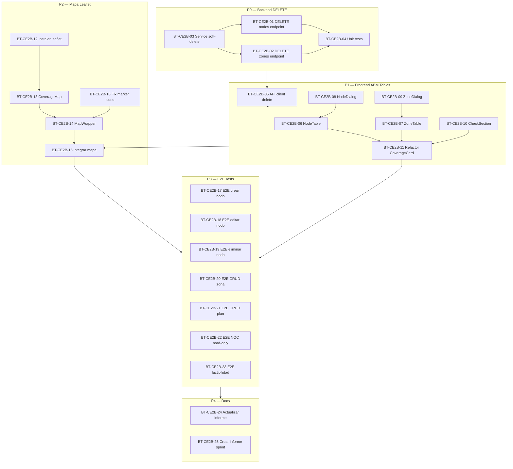

# PLAN — MOD03 Configuracion Empresarial — Fase 02-B Sprint 01

**Version:** 1.0  
**Estado:** Aprobado  
**Fecha:** 2026-03-24  
**Modo activo:** EM  
**Autor:** AI-EM-ARCH  
**PRD de referencia:** docs/prds/PRD-MOD03-CONFIGURACION-EMPRESA-v1.0.md (v1.1)  
**HLD de referencia:** docs/hlds/HLD-MOD03-CONFIGURACION-EMPRESA-v1.0.md (v1.1)  
**Plan previo:** docs/plans/PLAN-MOD03-CONFIGURACION-EMPRESA-FASE-02-v1.0.md  
**Prompt de ejecucion:** docs/prompts/PROMPT-MOD03-FASE-02B-v1.0.md  
**Informe soporte:** docs/informes/INFORME-MOD03-AUDITORIA-ESTADO-v1.0.md  
**ADRs aplicables:** ADR-016, ADR-018, ADR-019, ADR-022, ADR-023

---

## 1. Objetivo del sprint

Completar el Frontend de Cobertura Comercial (ABM de nodos y zonas con mapa interactivo Leaflet), agregar endpoints DELETE (soft-delete) en backend, y crear pruebas E2E con validacion de roles. El Catalogo de Planes (PlanCatalogManager) ya esta implementado — solo requiere validacion E2E.

### Contexto de la brecha

La auditoria de estado (INFORME-MOD03-AUDITORIA-ESTADO-v1.0) identifico que:
- Fase 01 (Perfil + Operacional): **100% completada**
- Fase 02 Backend (Cobertura + Planes): **100% completado**
- Fase 02 Frontend Planes (PlanCatalogManager): **~95% completado** (falta E2E)
- Fase 02 Frontend Cobertura (CommercialCoverageCard): **~30%** (falta ABM y mapa)
- Endpoints DELETE nodos/zonas: **No existe**
- Tests E2E: **No existen** para cobertura ni planes

Este sprint cierra esas brechas.

---

## 2. Precondiciones

- Backend CRUD de cobertura (GET/POST/PATCH) ya operativo en `TenantController`
- Entidades `CommercialNode`, `CoverageZone`, `PlanCatalogItem` con migraciones aplicadas
- API client del portal ya tiene metodos para cobertura (excepto delete)
- `CommercialTabLayout` con sub-navegacion WCAG funcional
- `Dialog` de `@iwana/ui` disponible y usado por `PlanCatalogManager`
- `PlanCatalogManager` ya implementado con ABM completo

---

## 3. Backlog

### P0 — Backend: Endpoints DELETE (bloqueante para P1)

| ID | Tarea | Archivos objetivo | Criterios de cierre | Estado |
| --- | --- | --- | --- | --- |
| BT-CE2B-01 | Agregar `DELETE /tenants/me/coverage/nodes/:nodeId` | `apps/api/src/modules/tenant/tenant.controller.ts` | Endpoint protegido con `JwtAuthGuard`, `RolesGuard`, `AbacGuard`. Ejecuta soft-delete (`deletedAt` + `isActive=false`). Retorna `CoverageAdminConfig` actualizado. | Pendiente |
| BT-CE2B-02 | Agregar `DELETE /tenants/me/coverage/zones/:zoneId` | `apps/api/src/modules/tenant/tenant.controller.ts` | Mismo patron que BT-CE2B-01 para zonas. | Pendiente |
| BT-CE2B-03 | Implementar `removeCoverageNode()` y `removeCoverageZone()` en service | `apps/api/src/modules/tenant/tenant.service.ts` | Soft-delete idempotente. Registra auditoria. Aislamiento por tenant (tenant A no borra nodo de tenant B). | Pendiente |
| BT-CE2B-04 | Unit tests de DELETE | `apps/api/src/modules/tenant/tenant.service.spec.ts` | Verificar soft-delete setea `deletedAt`. Nodo/zona no aparece en GET posterior. Test de aislamiento de tenant. | Pendiente |

### P1 — Frontend: ABM Tablas CRUD de Cobertura (depende de P0)

| ID | Tarea | Archivos objetivo | Criterios de cierre | Estado |
| --- | --- | --- | --- | --- |
| BT-CE2B-05 | Agregar `deleteCoverageNode()` y `deleteCoverageZone()` al API client | `apps/portal/src/lib/api-client.ts` | Metodos tipados, retornan `CoverageAdminConfig`. Replicar patron de `deletePlan()`. | Pendiente |
| BT-CE2B-06 | Crear `CoverageNodeTable.tsx` | `apps/portal/src/components/settings/CoverageNodeTable.tsx` | Tabla con columnas: Nombre, Lat, Lng, Estado, Acciones (editar, toggle active, eliminar). Prop `canEdit` para modo read-only. `data-testid="coverage-node-table"`. | Pendiente |
| BT-CE2B-07 | Crear `CoverageZoneTable.tsx` | `apps/portal/src/components/settings/CoverageZoneTable.tsx` | Tabla con: Nombre, Lat Centro, Lng Centro, Radio km, Estado, Acciones. `data-testid="coverage-zone-table"`. | Pendiente |
| BT-CE2B-08 | Crear `CoverageNodeDialog.tsx` | `apps/portal/src/components/settings/CoverageNodeDialog.tsx` | Dialog de `@iwana/ui` con Zod schema: `name` (max 150, required), `latitude` (-90 a 90), `longitude` (-180 a 180), `isActive`. Modo crear y editar. `data-testid="node-dialog"`. | Pendiente |
| BT-CE2B-09 | Crear `CoverageZoneDialog.tsx` | `apps/portal/src/components/settings/CoverageZoneDialog.tsx` | Dialog con Zod: `name`, `centerLatitude`, `centerLongitude`, `radiusKm` (0.1-300), `isActive`. `data-testid="zone-dialog"`. | Pendiente |
| BT-CE2B-10 | Extraer `CoverageCheckSection.tsx` | `apps/portal/src/components/settings/CoverageCheckSection.tsx` | Extraer validador de factibilidad actual de `CommercialCoverageCard`. Props: `onCheck`, `canEdit`. Self-contained. | Pendiente |
| BT-CE2B-11 | Refactorizar `CommercialCoverageCard.tsx` | `apps/portal/src/components/settings/CommercialCoverageCard.tsx` | Orquestador: componer con tablas, dialogos, check section y mapa. Gestionar estados: `nodes[]`, `zones[]`, `isNodeDialogOpen`, `isZoneDialogOpen`, `editingNodeId`, `editingZoneId`. Contadores dinamicos. `canEdit` prop para RBAC. | Pendiente |

### P2 — Frontend: Mapa Interactivo Leaflet (paralela parcial con P1)

| ID | Tarea | Archivos objetivo | Criterios de cierre | Estado |
| --- | --- | --- | --- | --- |
| BT-CE2B-12 | Instalar dependencias Leaflet | `apps/portal/package.json` | `pnpm --filter @iwana/portal add leaflet react-leaflet && pnpm --filter @iwana/portal add -D @types/leaflet`. Verificar `pnpm audit` sin CVEs nuevas. | Pendiente |
| BT-CE2B-13 | Crear `CoverageMap.tsx` | `apps/portal/src/components/settings/CoverageMap.tsx` | Client Component (`'use client'`). Props: `nodes[]`, `zones[]`, `onNodeClick(node)`, `onMapClick(latlng)`, `readonly`. Tiles OpenStreetMap. Markers azul/gris, Circles con radio. CSS Leaflet importado internamente. Centro default: Bogota (4.6097, -74.0817). `data-testid="coverage-map"`. | Pendiente |
| BT-CE2B-14 | Crear `CoverageMapWrapper.tsx` | `apps/portal/src/components/settings/CoverageMapWrapper.tsx` | `next/dynamic(() => import('./CoverageMap'), { ssr: false })`. Pasa props transparentemente. Muestra skeleton durante carga. | Pendiente |
| BT-CE2B-15 | Integrar mapa en `CommercialCoverageCard` | `apps/portal/src/components/settings/CommercialCoverageCard.tsx` | Mapa debajo de tablas. Click en marker → abre `CoverageNodeDialog` edicion. Click en mapa vacio → abre `CoverageNodeDialog` creacion con lat/lng pre-llenados. Actualiza dinamicamente tras mutaciones. En modo `readonly` desactiva `onMapClick`. | Pendiente |
| BT-CE2B-16 | Fix de marker icons Leaflet en Next.js | `apps/portal/public/` o componente | Copiar/importar marker icons de `leaflet/dist/images/` a `public/leaflet/` o configurar `L.icon()` para resolver correctamente. | Pendiente |

### P3 — E2E Tests Playwright (depende de P1 + P2)

| ID | Tarea | Archivos objetivo | Criterios de cierre | Estado |
| --- | --- | --- | --- | --- |
| BT-CE2B-17 | E2E: ADMIN crea nodo de cobertura | `e2e/tests/portal-settings-empresa.spec.ts` | Navega a Comercial > Cobertura, click "Agregar nodo", llena nombre + lat + lng, guardar, verificar en tabla. Mock de `POST /coverage/nodes`. | Pendiente |
| BT-CE2B-18 | E2E: ADMIN edita y desactiva nodo | `e2e/tests/portal-settings-empresa.spec.ts` | Click editar nodo existente, modificar nombre, guardar. Toggle isActive. Mock de `PATCH /coverage/nodes/:id`. | Pendiente |
| BT-CE2B-19 | E2E: ADMIN elimina nodo | `e2e/tests/portal-settings-empresa.spec.ts` | Click eliminar, confirmar, verificar nodo desaparece. Mock de `DELETE /coverage/nodes/:id`. | Pendiente |
| BT-CE2B-20 | E2E: ADMIN CRUD zona de cobertura | `e2e/tests/portal-settings-empresa.spec.ts` | Crear zona con nombre + centro + radio. Editar. Eliminar. Mocks correspondientes. | Pendiente |
| BT-CE2B-21 | E2E: ADMIN CRUD plan de servicio | `e2e/tests/portal-settings-empresa.spec.ts` | Crear plan con nombre + tecnologia + velocidades + precio. Editar. Eliminar. Valida `PlanCatalogManager` existente. | Pendiente |
| BT-CE2B-22 | E2E: NOC ve cobertura y planes en read-only | `e2e/tests/portal-settings-empresa.spec.ts` | Login como NOC, navegar a Comercial, verificar que no hay botones de accion (crear, editar, eliminar), solo tablas informativas y mapa pasivo. | Pendiente |
| BT-CE2B-23 | E2E: Validador de factibilidad | `e2e/tests/portal-settings-empresa.spec.ts` | Ingresar coordenadas, click validar, verificar resultado de matches. Mock de `GET /coverage/check`. | Pendiente |

### P4 — Documentacion (paralela con P3)

| ID | Tarea | Archivos objetivo | Criterios de cierre | Estado |
| --- | --- | --- | --- | --- |
| BT-CE2B-24 | Actualizar informe de auditoria | `docs/informes/INFORME-MOD03-AUDITORIA-ESTADO-v1.0.md` | Marcar brechas como cerradas. Agregar seccion de resultados post-implementacion. | Pendiente |
| BT-CE2B-25 | Crear informe de sprint | `docs/informes/INFORME-MOD03-FASE-02B-v1.0.md` | Documentar: endpoints agregados, componentes implementados, decision Leaflet, cobertura E2E, riesgos cerrados y pendientes. | Pendiente |

---

## 4. Dependencias entre tareas

---

## 5. Selectores de test estables (data-testid)

| Selector | Componente | Uso |
| --- | --- | --- |
| `coverage-node-table` | CoverageNodeTable | Tabla de nodos |
| `coverage-zone-table` | CoverageZoneTable | Tabla de zonas |
| `add-node-btn` | CommercialCoverageCard | Boton crear nodo |
| `add-zone-btn` | CommercialCoverageCard | Boton crear zona |
| `node-dialog` | CoverageNodeDialog | Dialogo crear/editar nodo |
| `zone-dialog` | CoverageZoneDialog | Dialogo crear/editar zona |
| `coverage-map` | CoverageMap | Contenedor del mapa Leaflet |
| `coverage-check-section` | CoverageCheckSection | Seccion validador factibilidad |
| `node-edit-btn-{id}` | CoverageNodeTable | Boton editar nodo especifico |
| `node-delete-btn-{id}` | CoverageNodeTable | Boton eliminar nodo especifico |
| `zone-edit-btn-{id}` | CoverageZoneTable | Boton editar zona especifica |
| `zone-delete-btn-{id}` | CoverageZoneTable | Boton eliminar zona especifica |

---

## 6. Criterios de aceptacion del sprint

| ID | Criterio |
| --- | --- |
| CA-S01 | ADMIN puede crear, editar, activar/desactivar y eliminar nodos de cobertura desde el portal |
| CA-S02 | ADMIN puede crear, editar, activar/desactivar y eliminar zonas de cobertura desde el portal |
| CA-S03 | El mapa Leaflet muestra nodos (markers) y zonas (circles) correctamente |
| CA-S04 | Click en marker abre dialogo de edicion; click en mapa vacio abre dialogo de creacion con lat/lng |
| CA-S05 | NOC/ACCOUNTANT/SUPPORT ven tablas y mapa en modo read-only sin botones de accion |
| CA-S06 | Los endpoints DELETE ejecutan soft-delete y no eliminan registros fisicamente |
| CA-S07 | PlanCatalogManager existente se valida con E2E sin regresiones |
| CA-S08 | El validador de factibilidad muestra matches correctos |
| CA-S09 | `pnpm typecheck` y `pnpm lint` pasan sin errores nuevos |
| CA-S10 | `pnpm --filter @iwana/api test` pasa con los nuevos tests de DELETE |
| CA-S11 | Todos los E2E del sprint pasan en `pnpm test:e2e:portal` |

---

## 7. Archivos de referencia

### Para replicar patrones (NO modificar estos archivos, solo usarlos como referencia)

| Archivo | Patron que aporta |
| --- | --- |
| `apps/portal/src/components/settings/PlanCatalogManager.tsx` | ABM con Dialog + Zod + tabla + optimistic updates + delete |
| `apps/portal/src/components/settings/CommercialTabLayout.tsx` | Sub-navegacion accesible con WCAG |
| `apps/portal/src/components/settings/SettingsClient.tsx` | Orquestador de tabs y carga inicial |
| `e2e/tests/portal-settings-empresa.spec.ts` | Patron de mocks y selectores en E2E existentes |

### Entidades y DTOs existentes (referencia)

| Archivo | Contenido |
| --- | --- |
| `apps/api/src/modules/tenant/entities/commercial-node.entity.ts` | Entidad CommercialNode |
| `apps/api/src/modules/tenant/entities/coverage-zone.entity.ts` | Entidad CoverageZone |
| `apps/api/src/modules/tenant/entities/plan-catalog-item.entity.ts` | Entidad PlanCatalogItem |
| `apps/api/src/modules/tenant/dto/tenant-commercial-coverage.dto.ts` | DTOs de cobertura |
| `apps/api/src/modules/tenant/dto/tenant-plan-catalog.dto.ts` | DTOs de planes |

---

## 8. Verificacion global post-sprint

1. `pnpm typecheck` — sin errores de tipos en todo el monorepo
2. `pnpm lint` — sin warnings nuevos
3. `pnpm --filter @iwana/api test` — unit tests backend (existentes + nuevos DELETE)
4. `pnpm test:e2e:portal` — todos los E2E existentes + nuevos pasan
5. Verificacion manual: Login ADMIN → Settings → Comercial → Cobertura → crear nodo (via form y via mapa), editar, ver en mapa, crear zona con radio, validar factibilidad
6. Verificacion manual: Login NOC → Settings → Comercial → confirmar modo read-only
7. `pnpm audit` — sin CVEs criticas post-instalacion de leaflet

---

_Documento emitido en Modo EM — AI-EM-ARCH_  
_Fecha: 2026-03-24_
